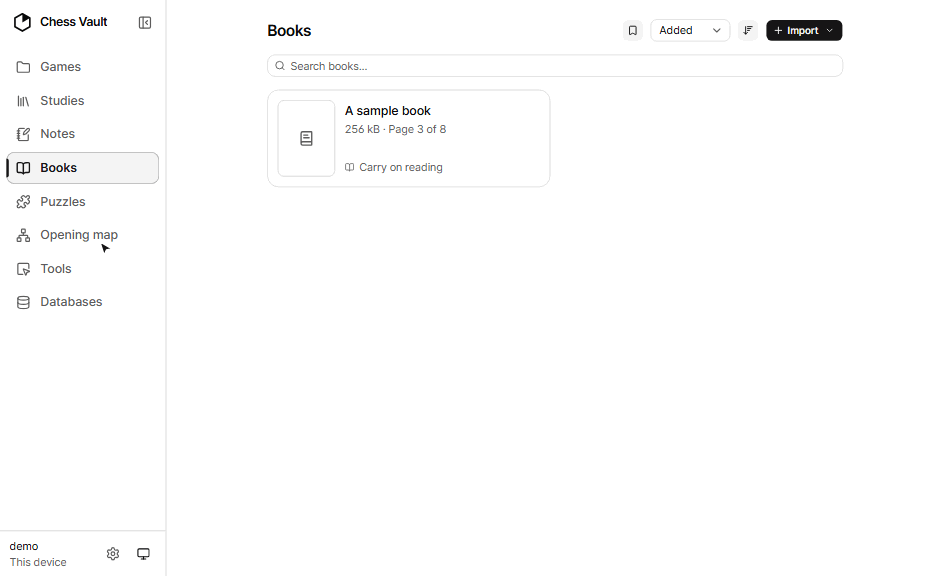

# Chess Vault

*[English](README.md) · 한국어*

당신의 체스를, 평범한 파일로. 직접 호스팅하는 개인 체스 작업대입니다. 엔진
분석, 오프닝 탐색기, 스터디, 노트, 손수 고른 게임 모음, 그리고 실제
종이책에서 읽어 온 퍼즐 트레이너까지 — 모든 것이 PGN, 마크다운, JSON으로
당신이 소유한 폴더 하나에 저장됩니다.

**먼저 써 보세요:** [라이브 데모](https://chessvault-app.github.io/app/)는
앱 전체를 브라우저에서, 미리 채워 둔 보관함 위에서 그대로 돌립니다. 설치도
가입도 필요 없습니다. 둘러보기는
[소개 페이지](https://chessvault-app.github.io/)에 있습니다.

**빠른 시작:**
[릴리스](https://github.com/chessvault-app/chessvault/releases/latest)에서
Windows·macOS·Linux용 설치 프로그램을 받아 실행하고, 보관함이 어디 있는지
물으면 **로컬**이라고 답하세요. 설정은 그것으로 끝입니다. 자세한 내용은 —
그리고 모든 기기에서 같은 보관함을 쓰고 싶어질 때 고를 두 번째 길은 —
[실행하는 두 가지 방법](#실행하는-두-가지-방법)에 있습니다.

**출발점은 Obsidian입니다.** 그중 체스에도 그대로 가져올 만한 것이 두 가지
있고, 이 앱은 그 둘 위에 서 있습니다.

*모든 것이 내 디스크 위의 평범한 파일입니다.* 보관함은 폴더 하나입니다 —
PGN, 마크다운, JSON — 어떤 편집기로도 열리고 어떤 백업 도구로도 복사됩니다.
작업물을 인질처럼 붙잡아 두는 데이터베이스도, 내보내기 단계도 없고, 이 앱이
사라져도 읽히지 않게 되는 것은 없습니다. 데이터베이스인 것들 (퍼즐 풀, 참고
게임, 인덱스)은 모두 파생 데이터라 보관함 바깥에 따로 살고, 언제든 지우고
다시 만들 수 있습니다.

*모든 것이 서로를 가리킬 수 있습니다.* 노트가 스터디를, 스터디가 게임을,
게임이 다시 무엇이 잘못됐는지 정리해 둔 노트를 가리킵니다 — Obsidian과 같은
`[[위키 링크]]`로, 셋 사이를 가로질러 이어집니다. 체스 자료는 흩어진 문서
더미가 아니라 하나로 이어진 작업물이고, 그렇게 만들어 주는 것이 바로 이
링크입니다.

<picture>
  <source media="(prefers-color-scheme: dark)" srcset="docs/screenshots/board-dark.png">
  
</picture>

## 기능

- **보드** — Stockfish 18(WASM, 멀티스레드)로 자유롭게 분석합니다.
  변화수·주석·NAG(`!`, `?!` 같은 기호 주석)·화살표를 갖춘 완전한 수 트리,
  오프닝 탐색기(로컬 데이터베이스 + Lichess), 정확도와 정직한 브릴리언트
  판정이 있는 게임 리뷰, 그리고 FEN, PGN 또는 아무 보드나 찍은
  *사진/스크린샷*으로 포지션 불러오기를 지원합니다.
- **편집기** — 원하는 포지션을 만듭니다. 팔레트에서 기물을 끌어다 놓거나
  이미지에서 가져올 수 있습니다.
- **스터디** — 변화수, 수마다의 주석, NAG, 그려 넣은 화살표를 갖춘 PGN 챕터
  스터디입니다. 읽는 중에도 주석을 다는 중에도 기물은 움직이며, 주석 모드
  전환은 그냥 수를 따라갈 때 보드를 깔끔하게 유지해 줍니다. PGN 파일을
  가져오거나, 붙여넣거나, Lichess 계정에서 스터디를 바로 끌어올 수 있습니다.
  저장은 직접 하는 것이고(자동 저장은 설정이며 기본값은 꺼짐), 저장하지 않은
  표시와 나갈 때의 확인이 따라붙으며, 브라우저가 죽어도 작업이 사라지지
  않도록 사본이 보관함에 남습니다. 쓰기는 원자적이고, 저장은 코덱 왕복이라
  `shared/pgn.test.ts`가 그것이 무손실이면서 *멱등*임을 검증합니다 — 손실이
  있는 코덱은 보관함을 조용히 갉아먹기 때문입니다.
- **노트** — 대화형 보드를 (```` ```chess ```` 펜스로) 끼워 넣을 수 있는
  마크다운 노트입니다. 노트·스터디·게임을 가로지르는 Obsidian 방식의
  `[[위키 링크]]`를 지원하며, 파일은 Obsidian에서도 그대로 읽힙니다.
- **게임** — 손수 고른 모음(스터디처럼 주석을 달 수 있습니다), 월별로 필터와
  함께 넘겨 보는 chess.com / Lichess 기보, 직접 PGN 가져오기, 그리고 검색
  가능한 엘리트 게임 참고 데이터베이스입니다.

  <picture>
    <source media="(prefers-color-scheme: dark)" srcset="docs/screenshots/games-dark.png">
    
  </picture>

- **책** — 내 체스 책의 서재입니다. 어떤 PDF든 올려 앱 안에서, 분석 보드
  옆의 창에서 읽습니다. 인쇄된 다이어그램마다 그 포지션을 판에 놓는 체스판
  버튼이 붙습니다. 파일은 내 보관함에 남고 바이트 범위로 서빙되며, 읽던 쪽은
  책마다 기억됩니다.

  

- **퍼즐** — 난이도 구간과 진행 대시보드, 그리고 복습 스케줄을 갖춘
  Lichess 테마 트레이너입니다. 틀린 퍼즐은 간격을 두고 돌아오고(하루,
  그다음 3·7·21일), 매 단계를 깔끔하게 풀면 목록에서 은퇴합니다. 더해
  **책 퍼즐**이 있습니다. 스캔한 전술책 PDF를 가져오기(앱의 퍼즐 → 퍼즐 책 →
  책 가져오기)에 넘기면 ML 파이프라인이 다이어그램을 읽고, 인쇄된 정답을
  해석하고, 재생해서 검증한 뒤, 각 퍼즐을 정직한 신뢰 등급과 원본 페이지
  스캔을 한 번에 들춰 볼 수 있는 링크와 함께 가져옵니다. 책도 같은
  스케줄로 복습되며, 우드페커식 사이클로도 풀 수 있습니다 — 책 전체를
  회차로 반복하고, 사이클마다 모든 퍼즐을 한 번씩, 첫 시도로 점수를
  매깁니다. 책이 함께 딸려
  오지는 않습니다. 직접 가진 책의 PDF를 넣으면, 거기서 나온 퍼즐은 내
  보관함에만 남습니다 — [책 가져오기와 저작권](#책-가져오기와-저작권)을 함께
  읽어 주세요.

  <picture>
    <source media="(prefers-color-scheme: dark)" srcset="docs/screenshots/dashboard-dark.png">
    
  </picture>

- **도구** — 대화형 보드들을 묶어 놓은 곳입니다. 분석 **보드**, 포지션
  **편집기**, 오프닝 **탐색기**로 가는 지름길, 그리고 필드를 상대로 오프닝을
  연습하는 **레퍼토리** 트레이너(상대는 레이팅 구간으로 거른 Lichess
  데이터베이스, 또는 함께 오는 것을 포함한 아무 로컬 참고 데이터베이스 —
  그래서 오프라인에서도 됩니다. 실제 채택 빈도에 비례해 무작위로 응수하고,
  변화가 정석을 벗어나면 자연스럽게 엔진으로 넘깁니다). 같은 필드를 상대로
  내 스터디를 드릴하며 틀린 곳을 기억해 두기도 합니다([작동
  방식](docs/repertoire.ko.md)).
- **오프닝 맵** — 준비한 것들을 별자리로, 또는 순서대로 읽고 싶을 때는
  트리로 봅니다. 레퍼토리를 이루는 수를 직접
  배치하고(색마다 맵 하나), 그것을 다루는 스터디와 노트를 연결합니다. 연결된
  스터디 아래의 모든 것은 저장되는 대신 그 스터디에서 실시간으로 유도되므로,
  커버리지와 깊이와 드릴 상태는 언제나 사실입니다. 필드를 지정하면 — 내
  게임이든, Lichess 데이터베이스든, 로컬 참고 데이터베이스든 — 각 수를
  실제로 두어지는 빈도만큼 키우고, 답이 없는 응수에 배지를 달고, 고르거나
  검색한 것에서부터 필드가 걷는 길을 밝힙니다([작동
  방식](docs/opening-map.ko.md)).

  <picture>
    <source media="(prefers-color-scheme: dark)" srcset="docs/screenshots/opening-map-dark.png">
    
  </picture>
- **탐색기에서 보는 내 게임.** 참고 데이터베이스와 Lichess 데이터베이스 옆에
  **내 게임** 소스가 있습니다. 보관함의 모든 게임을 대상으로 *이 포지션에서
  나는 무엇을 뒀고 결과는 어땠는가*에 답하며, 내가 잡은 색, 승패, 시간제,
  날짜로 걸러 볼 수 있습니다. 만들 것도 다시 만들 것도 없습니다. 게임을
  모음에 담는 순간 반영되고, 목록의 게임은 눌러서 보드에 바로 엽니다.
- **홈** — 시작 페이지는 마지막으로 하던 일을 맨 위에 보여주고, 구성은
  직접 정합니다. 어떤 항목을 타일로 둘지와 그 순서를 고르고, 계속·준비
  카드를 켜고 끕니다. 끈 항목도 아래 줄에 버튼으로 남으므로 손이 닿지
  않게 되는 곳은 없습니다. 구성은 보관함에 저장되어, 그 보관함을 여는
  모든 기기가 같은 화면을 봅니다.
- **설정** — 앱 비밀번호 변경, 인증 앱 2단계 인증 켜기, 표시 이름과 플랫폼
  사용자명 설정, 보드 테마와 기물 세트 선택, Lichess 토큰 관리, 보관함
  비우기 — 전부 앱 안에서 되며, 셸이 필요 없습니다.
- **어디서나** — 휴대폰까지 반응하는 레이아웃, PWA 설치(홈 화면 아이콘,
  스플래시 화면, 오프라인 셸), 그리고 데스크톱 앱(Windows·macOS·Linux 설치
  프로그램)을 지원합니다. 데스크톱 앱은 기본적으로 그 기기에 보관함을 두고,
  원하면 서버의 클라이언트로도 씁니다. 휴대폰에서는 하단 바가 현재 페이지의
  조작(수 이동, 퍼즐 동작)으로 바뀝니다 — chess.com·Lichess와 같은
  방식입니다.

키보드: `←` `→` 한 수씩 이동 · `↑`/`Home` 처음 · `↓`/`End` 끝 · `f` 보드
뒤집기 · `Enter` 입력한 수 두기 · `Ctrl/⌘ S` 저장 · `Esc` 열린 창 닫기 ·
`?` 이 목록을 앱 안에서.

## 실행하는 두 가지 방법

둘 다 같은 코드를 돌립니다. 차이는 **보관함이 어디 있느냐**뿐입니다 — 게임,
스터디, 노트, 퍼즐이 담긴 그 폴더 말입니다.

| | **이 기기에서** | **서버에서** |
| --- | --- | --- |
| 보관함 위치 | 내 컴퓨터 | 작은 리눅스 서버 한 대 |
| 접근하는 곳 | 그 컴퓨터 | 휴대폰·노트북·데스크톱 모두 클라이언트 |
| 필요한 것 | 없음 | 계속 켜 둘 기계, 그리고 HTTPS |
| 갱신 방법 | 새 앱 설치 | `bash scripts/deploy.sh` |

여러 기기에서 같은 보관함을 쓰고 싶을 때만 두 번째를 고르세요. 첫 번째로
시작해도 잃는 것은 없습니다. 보관함은 폴더이므로, 나중에 서버로 옮기는 일은
그 폴더를 복사하는 것입니다.

### A · 이 기기에서

Windows·macOS·Linux용
[릴리스](https://github.com/chessvault-app/chessvault/releases/latest)에서
**앱을 내려받아** 설치하세요. 그 밖에는 아무것도 필요 없습니다 — Node도,
터미널도요.

처음 실행하면 보관함이 어디 있는지 묻습니다. **로컬**을 고르세요. 앱이
서버를 직접 띄우고 모든 것이 이 기기에 남습니다. (다른 답인 *원격*을 고르면
같은 앱이 직접 운영하는 서버를 바라보는 창이 됩니다 — B를 보세요.) 그다음
어떤 폴더를 쓸지 묻습니다:

- **앱이 관리하는 보관함** — 사용자 프로필 안에 폴더를 잡고 바로 시작합니다.
- **폴더 열기…** — 아무 폴더나 보관함이 됩니다. 이미 쓰던 폴더도 됩니다.
  파생 데이터(참고 데이터베이스, 색인)도 그 폴더 안에 들어가므로, 폴더를
  옮기거나 동기화하면 전부 함께 따라갑니다.

업데이트도 같은 릴리스에서 앱이 알아서 받아 옵니다.

**열리고 나서 처음 몇 분:** 설정에 chess.com / Lichess 사용자명을 넣으면
게임 페이지가 기보를 넘겨 보기 시작하고, 퍼즐을 열어 앱이 받아 주겠다는
데이터베이스를 받으면 트레이너가 준비됩니다.
[아래](#lichess-토큰-선택-사항)의 Lichess 토큰은 온라인 부가 기능을
쓰고 싶을 때만 필요합니다.

설치 프로그램을 직접 만들거나 소스 트리에서 돌리려면:

```bash
npm install
npm run desktop:package        # 또는 :mac / :linux — 설치 프로그램
# ...설치 프로그램 없이 그냥 돌리려면:
npm run build                  # 웹 앱 -> dist/
npm start                      # http://127.0.0.1:8787
```

소스에서 돌릴 때 보관함은 `CHESS_VAULT_DIR`로 달리 지정하지 않는 한 저장소의
`vault/`입니다. 비밀번호는 필요 없습니다 — 이 기기 밖으로 열려 있는 것이
없으니까요.

### B · 서버에서

한 대가 보관함을 갖고, 모든 기기가 클라이언트가 됩니다. **Node 22.12
이상**(CI와 참조 배포는 24를 씁니다)과, 오래 둘 자리에 만든 git 체크아웃이
필요합니다:

```bash
# 서버에서 한 번
sudo git clone https://github.com/chessvault-app/chessvault /srv/chess-vault-app
cd /srv/chess-vault-app
npm ci
npm run build                          # 웹 앱 -> dist/
CHESS_VAULT_DIR=/srv/chess-vault npm run start   # 우선 포그라운드로 확인
```

마지막 줄은 셸에서 그대로 돌아갑니다. 처음 확인할 때는 괜찮지만 그 뒤로는
곤란합니다. 서비스로 만들어 주세요. `scripts/deploy.sh`가 이름으로 서비스를
재시작하며, 아래 경로들이 그 기본값입니다:

```ini
# /etc/systemd/system/chess-vault.service
[Unit]
Description=Chess Vault server
After=network.target

[Service]
Type=simple
User=ubuntu
WorkingDirectory=/srv/chess-vault-app
Environment=CHESS_VAULT_DIR=/srv/chess-vault
Environment=NODE_ENV=production
ExecStart=/usr/bin/npm run start
Restart=always
RestartSec=3

[Install]
WantedBy=multi-user.target
```

```bash
sudo systemctl enable --now chess-vault
```

한 포트가 빌드된 앱과 HTTP API를 함께 서빙합니다. 그다음:

1. **앞에 HTTPS를 두세요.** 리버스 프록시는 사실상 필수입니다. PWA 설치와
   Stockfish의 멀티스레딩 둘 다 보안 컨텍스트이면서 교차 출처 격리된
   페이지를 요구합니다. 어떤 프록시든 됩니다. Caddy라면 두 줄이면 되고
   인증서도 알아서 처리됩니다:

   ```caddy
   vault.example.com {
       reverse_proxy 127.0.0.1:8787
   }
   ```

   [Tailscale](https://tailscale.com) 테일넷은 다른 길입니다. 인터넷에
   노출하지 않고도 HTTPS 이름을 갖게 해 주며, 참조 배포가 쓰는 방식입니다.
2. **잠금 화면을 켜세요.** 설정에서 앱 비밀번호를 정하고(또는
   `vault/config.json`의 `appPassword`), 인증 앱 2단계 인증도 함께 켜세요.
   인터넷에서 닿는 것이라면 반드시 필요합니다.
3. **기기를 연결하세요.** 휴대폰은 URL을 열고 홈 화면에 추가하면 오프라인
   셸을 갖춘 PWA로 설치됩니다. 데스크톱은 앱을 설치하고 *원격* 모드에서 서버
   주소를 넣으세요.

설정에는 버전이 두 개 보이는데, 서로 다른 것입니다. **서버** 버전은 지금
연결된 웹 앱과 API이고, **데스크톱 앱** 버전은 그것을 감싼 Electron
창입니다. 로컬 모드에서는 설치 파일 하나에 둘 다 들어 있으므로 언제나
같습니다. 원격 모드에서는 서로 독립적이며, 달라도 정상입니다.

**서버 갱신**은 작업용 컴퓨터에서 명령 하나입니다:

```bash
cp scripts/deploy.env.example scripts/deploy.env   # CHESS_VAULT_HOST 설정
bash scripts/deploy.sh
```

웹 앱은 로컬에서 빌드하고(가장 무거운 단계입니다 — 2 GB 기계는 여기서
메모리가 터질 수 있습니다), 커밋과 빌드된 `dist/`를 보내고, `npm ci`를
돌리고, 데이터베이스 인덱스를 최신으로 맞추고, 서비스를 재시작한 뒤 다시
살아났는지 확인합니다. 보관함은 건드리지 않습니다.

SSH는 공개 인터넷에 두지 마세요. 참조 배포는 방화벽에서 22번 포트를 닫은
채 [Tailscale](https://tailscale.com) 테일넷 위에서 돌아가고, `deploy.sh`가
테일넷을 통해 접근합니다.

백업은 여러 겹입니다. 서버가 보관함의 모든 변경을 `vault/.history.git`에
자동 커밋하고(세밀한 되돌리기), 호스트의 스냅샷이 인스턴스 손실을 막고,
`scripts/backup-vault.sh`가 히스토리까지 포함한 보관함 전체를 아무 기계로나
내려받습니다.

첫 번째 겹은 git 없이 앱 안에서 바로 쓸 수 있습니다. 모든 스터디와 게임과
노트의 머리글에 있는 시계 아이콘이 저장된 시점들을 보여 주고, 그때 무엇이
있었는지 확인한 뒤 되돌릴 수 있습니다. 아예 삭제된 문서는 설정 → 삭제된
문서에서 되살립니다. 복원은 파일을 제자리에 덮어쓰지만, 덮이는 상태를 먼저
커밋하므로 잠시 뒤 같은 목록에서 다시 되돌아올 수 있습니다.

## 선택 데이터

앱은 `data/`가 비어 있어도 돌아갑니다. 아래 세 가지는 특정 기능을 켜 주는
것들이며, `data/` 아래는 전부 파생물이라 git에서 제외되고 다시 만들 수
있습니다. 원하는 것만, 기기마다 만드세요 — 그리고 **전부 앱 안에서 됩니다**.
아래의 `npm run` 명령들은 터미널을 선호할 때의 대안이지 필수가 아닙니다.

| 데이터 | 켜지는 기능 | 만드는 방법 |
| --- | --- | --- |
| `data/puzzles.sqlite` | 퍼즐 트레이너 | 앱 안에서, 또는 `npm run build:puzzles` |
| `data/refgames/*.sqlite` | 데이터베이스 브라우저, 로컬 탐색기, 레퍼토리 트레이너, 오프닝 맵 | 시작용 세트가 앱과 함께 옵니다. 더 만들려면 앱 안에서, 또는 `npm run build:refgames` |
| `data/openings.json` | ECO 오프닝 이름 | 앱이 처음 쓸 때 스스로 |

`data/mygames.sqlite`가 표에 없는 이유는 만들 필요가 없기 때문입니다.
탐색기의 **내 게임** 소스가 보관함의 게임을 스스로 색인하고, 게임을 모을수록
알아서 따라옵니다. `data/openings.json`이 표에 있는 것은 이름이 어디서
오는지 밝히기 위해서일 뿐입니다. 서버가 함께 딸려 오는 ECO 표에서, 이름이
처음 필요해진 순간에 직접 컴파일합니다.

**설치 프로그램에는 시작용 데이터베이스가 하나 딸려 옵니다.** 그래서 갓
설치한 데스크톱도 빈 페이지 대신 첫 순간부터 답을 내놓습니다. *참고
데이터베이스*는 게임 전체와 포지션 색인을 한 SQLite 파일에 담은 것입니다.
게임은 게임 탭에서 선수·오프닝·ECO·대회·결과·레이팅으로 검색되고 아무
게임이나 보드에 열리며, 포지션 색인은 로컬 탐색기와 레퍼토리 트레이너가 답을
얻는 곳입니다 — 게임이 옆에 그대로 살아 있으니 걸러서 물어볼 수도 있습니다.
함께 오는 세트는 최근 Lichess Elite 한 달치에서 오프닝마다 가장 강한 판들을
남긴 것으로, 25 MB에 38,977판, CC0, 15수까지 색인되어 있습니다. 앱을 처음 실행할 때
`data/`로 복사되고, 그 뒤로는 평범한 파일입니다. 지우거나 그 위에 새로 만들
수 있고, 지우면 그것으로 끝이라 다시 생기지 않습니다. (이전 릴리스에는
게임을 합쳐 없앤 "오프닝 북"도 함께 딸려 왔습니다. 포지션 색인이 그것을
대신합니다 — 이제 산출물 하나가 두 질문에 답하고, 걸러서도 답합니다.)

저장소에 담아 두지 않고 릴리스를 낼 때 만듭니다. 그래서 릴리스마다 그 시점에
가까운 달의 데이터가 들어갑니다. **대신 서버 설치와 소스 체크아웃에는
없습니다** — 릴리스 산출물이 아니라 커밋을 받기 때문입니다 — 탐색기도 게임
브라우저도 비어 있는 상태로 시작합니다. **시작용이 모자라지면 직접
만드세요** — 어차피 그것이 원래 길입니다. 데이터베이스 페이지에서 PGN 모음을
올리고 만들기를 누르면 됩니다. 이 과정에서 `deploy.sh`도 앱도 기보를
내려받지 않습니다. 내려받는 것은 릴리스 워크플로뿐입니다.
(`npm run build:bundled-refgames`는 이미 가진 데이터를 설치 프로그램이 담는
크기로 추리는 명령입니다. 설치 프로그램을 직접 만들 때 쓰는 것이지, 첫
데이터베이스를 얻는 방법이 아닙니다.)

**만드는 데에 셸은 필요 없습니다.** 데이터베이스 페이지를 열어 PGN 모음을
올리고, 합칠 것을 골라 만들기를 누르면 됩니다. 무료로 쓸 만한
출처: [Lumbra's Gigabase](https://lumbrasgigabase.com/en/)의 "OTB Elite",
[Lichess Elite Database](https://database.nikonoel.fr/) — 뒤가 CC0,
앞이 CC BY-NC-SA 4.0입니다. 직접 쓰려고 만드는 데이터베이스에는 괜찮지만,
그렇게 만든 것을 남에게 넘기는 데는 쓸 수 없습니다. 포지션은 64비트 Zobrist
해시로 키를 만듭니다 — Lichess Elite 한 달치(280,059 게임)를 만드는 데 약
100초, 그 포지션 색인(15수까지 830만 행)에 다시 약 80초가 걸립니다.

**터미널이 편하다면.**

```bash
# Lichess Elite 한 달치 — CC0, 압축 ~80 MB, 기보 약 28만 판
curl -O https://database.nikonoel.fr/lichess_elite_2025-11.zip
unzip lichess_elite_2025-11.zip -d vault/sources/

# 포지션 색인까지 포함한 전체 데이터베이스: ~540 MB, 약 3분
npm run build:refgames -- lichess_elite_2025-11.pgn
```

### 큰 둘

**퍼즐 트레이너는 앱이 스스로 만듭니다.** 데이터베이스가 없는 상태로 퍼즐을
열면 만들어 주겠다고 제안합니다. CC0 Lichess 덤프(~304 MB, 퍼즐 610만 개)를
진행 표시줄과 함께 내려받아 2.6 GB 데이터베이스로 만듭니다 — 내려받은 뒤
만드는 데 여기서 115초 걸렸습니다. 설치할 것도, 입력할 것도 없고, 페이지를
떠나도 계속됩니다. 터미널이 편하면 `npm run build:puzzles`가 똑같은 일을
합니다.

**참고 게임도 앱 안에서 만들고, 북처럼 여러 개입니다.** 데스크톱은 심어진 채
시작하고 — 설치 프로그램의 시작용 세트가 데이터베이스 하나로 자리를 잡습니다
— 데이터베이스 페이지에서 PGN 모음을 올리고 그중 골라 이름 붙인
데이터베이스를 옆에 하나 더 만듭니다. Elite 한 달치, OTB 모음, 클럽 기보 —
각각 따로 검색되고 게임 페이지의 데이터베이스 브라우저에서 바꿔 가며 봅니다.
그래서 교체도 특별한 일이 아닙니다. 같은 이름으로 다시 만들거나 새 이름으로
만들고, 필요 없어진 것을 지우면 됩니다. 데이터베이스는 **자라기도** 합니다.
행의 + 버튼은 아직 없는 게임만 색인하고, 포지션 색인도 다시 만드는 대신
이어서 늘립니다. 터미널이 편하다면 같은 색인기를 이렇게 돌립니다:

```bash
npm run build:refgames                       # vault/sources 전부
npm run build:refgames -- elite.pgn --name elite
```

빌드는 마지막에 이름을 바꿔 자리를 잡으므로, 돌고 있는 서버는 끝날 때까지 옛
파일을 계속 서빙합니다. 지운 데이터베이스는 함께 오는 시작용 세트처럼
그것으로 끝입니다.

**서버에서** 돌린다면, 퍼즐 빌드는 304 MB 압축 덤프를 흘려 넣어 2.6 GB
데이터베이스를 만들기 때문에 작은 인스턴스에서는 메모리가 터집니다. 여기서도
2 GB 기계에서 그랬습니다. 메모리가 넉넉한 기계에서 버튼을 누르거나, 작업용
컴퓨터에서 만든 뒤 서버의 데이터 디렉터리(`CHESS_VAULT_DATA`, 기본값은 앱
옆의 `data/`)로 `scp` 하세요. 이것은 서버냐 아니냐가 아니라 그 기계의 메모리
문제입니다.

이후 배포는 인덱스를 알아서 최신으로 유지하므로, 더 새 덤프나 더 많은 게임이
필요할 때만 다시 만들면 됩니다.

다시 만드는 방법은 [docs/databases.ko.md](docs/databases.ko.md)에 있습니다.
아직 터미널이 필요한 마지막 한 가지, 잘 돌아가는 퍼즐 데이터베이스를
교체하는 일도 거기 있습니다 — 만들기 제안은 데이터베이스가 아예 없을 때만
나타나기 때문입니다.

## 당신의 서버 말고는 아무 데도 연결하지 않습니다

CDN도, 텔레메트리도, 런타임의 제3자 요청도 없습니다. 글꼴, 아이콘, WASM,
CSS가 전부 함께 들어 있습니다. 바깥으로 나가는 기능은 *가져오기*(본래
일회성)와, 꺼 둘 수 있는 선택 사항인 Lichess 탐색기 보강뿐입니다.

**네트워크가 아예 없어도 됩니다.** 그것이 기본 구성입니다 — 앱도 보관함도 이
기기에 있으니, 인터넷이 필요한 부분이 없습니다. 엔진, 참고 데이터베이스,
퍼즐, 모아 둔 기보 전부요.

보관함을 서버로 옮겼다면(B 방식) 그 서버에 닿을 수 있어야 합니다. PWA가 셸은
오프라인으로 유지해 앱은 열리지만, 게임과 스터디는 연결 저편에 있습니다.
모든 기기에서 같은 보관함을 쓰는 대가로 일부러 치르는 값입니다.

## 구조

```
shared/     순수 TS: 수 트리 + PGN 코덱 (모두가 재사용하는 핵심)
server/     Hono 서버: 보관함 I/O, 인증 게이트 + 2FA, 설정, 프록시
web/        Vite + React UI
desktop/    Electron 셸 (원격 클라이언트 또는 자체 호스팅)
scripts/    빌더: 엔진 설치, 참고 게임 색인, ML 파이프라인
native/     데이터베이스 무거운 작업용 선택적 Rust 코어 (아래 참고)
data/       파생물 — 다시 만들 수 있음, git에서 제외
vault/      당신의 데이터 — 평범한 파일, git 친화적
```

**`vault/`가 대체 불가능한 부분입니다.** `data/` 안의 것은 지우고 다시 만들
수 있습니다. 백업이나 이전은 폴더 하나를 복사하는 일입니다.

**`native/`는 선택 사항입니다.** 무거운 데이터베이스 작업 네 가지(빌드,
색인, 최적화, 모든 게임에서 포지션 찾기)를 바이트 단위로 그대로 옮긴 Rust
크레이트 `chessvault-core`이고, JavaScript 파이프라인 자신의 답을 고정
답안으로 삼아 검증했습니다. 그 디렉터리에서 `cargo build --release`로
데스크톱 설치 프로그램이 해당 플랫폼용으로 빌드해 함께 담고 나가므로,
설치한 앱은 아무것도 하지 않아도 빠릅니다. 28만 판 빌드가 약 180초에서 약
72초로, 데이터베이스 전체 포지션 검색이 약 13초에서 약 1초로 줄고, 메모리는
4분의 1입니다. 서버나 소스 체크아웃에서는 `npm run build:native`를 하면 서버가 알아서
집어 씁니다. 조회가 작업마다 일어나므로 재시작도 필요 없습니다
([`native/README.md`](native/README.md) 참고). `scripts/deploy.sh`는 상자에 툴체인이
있으면 배포마다 그 빌드를 돌립니다. 정리가 아니라 정확성 문제입니다.
`native/target/`은 git에서 제외되므로, 그러지 않으면 예전 커밋에서 만든
바이너리가 더 새로운 JavaScript 옆에서 계속 답하게 되고, 고정 답안은 둘이
*같은* 커밋에서 일치한다는 것만 증명하기 때문입니다. 아무것도 없으면 모든
것이 이전 그대로 JavaScript로 돌아가고, `CHESS_NATIVE=0`은 바이너리가
있어도 그 경로를 강제합니다 — 둘을 비교할 때 쓰는 방법입니다.

## 개발하기

```bash
npm install
npm run dev          # 서버 + 웹, 핫 리로드, http://localhost:5173
```

처음 실행하면 Stockfish 엔진 자산을 `node_modules`에서 복사해
옵니다(7 MB 라이트 빌드. `npm run setup:engine -- --full`은 그 옆에 full
빌드를 더해 줍니다).

`native/`의 Rust 코어는 선택 사항이고 위 명령 중 어느 것도 그것을 빌드하지
않습니다. 원한다면 — 소스 체크아웃은 없어도 JavaScript 작업으로 돌아갑니다 —
[rustup.rs](https://rustup.rs)에서 툴체인을 설치하고 이렇게 합니다:

```bash
npm run build:native         # cargo build --release
npm run test:native          # JS 쪽과 대조하는 고정 답안 검증
npm run build:native-goldens # 계약이 바뀌었을 때 그 고정 답안을 다시 내보내기
```

서버는 다음 작업에서 바이너리를 집어 씁니다. 재시작은 필요 없습니다.
두 구현을 왜 바이트 단위로 묶어 두는지, 둘 중 하나가 계산하는 것을 바꿨을 때
무엇을 해야 하는지는 [`native/README.md`](native/README.md)에 있습니다.

## Lichess 토큰 (선택 사항)

*온라인* 탐색기 보강, 레퍼토리 트레이너의 Lichess 데이터베이스 상대, Lichess
계정에서 스터디 가져오기를 켭니다.
[lichess.org/account/oauth/token/create](https://lichess.org/account/oauth/token/create)에서
**권한은 아무것도 체크하지 않고** 만드세요(비공개 스터디에는 `study:read`,
Lichess 퍼즐 기록 가져오기에는 `puzzle:read`를 추가). 설정 페이지에
붙여넣거나 `vault/config.json`(git에서 제외됨)에 넣습니다:

```json
{ "lichessToken": "lip_..." }
```

`config.json`은 잠금 화면이 켜져 있을 때 `appPassword`와 2FA의
`totpSecret`도 담습니다. 설정 페이지가 이 셋을 모두 관리하며, 보관함의
히스토리 저장소는 비밀이 절대 들어가지 않도록 이 파일을 일부러 제외합니다.
비밀번호는 솔트가 들어간 해시(`scrypt:…`)로 저장됩니다. 손으로 평문을
적어 넣어도 동작하며, 다음 시작이나 로그인 때 해시로 바뀝니다. 로그인된
세션은 그 옆의 `vault/sessions.json`에 (토큰 자체가 아니라 해시만) 담기고,
같은 방식으로 히스토리 저장소에서 제외됩니다. 로그아웃하거나 비밀번호를
바꾸면 세션이 해지됩니다.

## 명령어

```bash
npm run dev            # 서버 + 웹, 핫 리로드
npm run build          # dist/로 프로덕션 빌드
npm start              # 빌드된 앱 서빙
npm test               # 단위 테스트
npm run typecheck      # tsc --noEmit
npm run setup:engine   # Stockfish를 web/public/engine/으로 복사
npm run build:bundled-refgames # 참고 게임을 설치 프로그램이 담는 시작용 세트로 추리기
npm run build:openings # ECO 이름 재컴파일 (앱이 알아서 합니다)
npm run build:refgames # 참고 데이터베이스 만들기 (기보 + 포지션 색인)
npm run build:puzzles  # Lichess 덤프로 퍼즐 트레이너 풀 만들기
npm run desktop:package        # Windows 설치 프로그램 (:mac, :linux도 있습니다)
npm run desktop:package:mac    # macOS dmg (Mac 또는 GitHub Actions 필요)
npm run desktop:package:linux  # Linux AppImage + deb
npm run desktop:release        # 검사, 태그, 푸시 — 설치 프로그램은 GitHub이 빌드합니다
```

서버 쪽은 작업용 컴퓨터에서 합니다. `bash scripts/deploy.sh`가 서버를
갱신하고, `bash scripts/backup-vault.sh`가 그 보관함을 내려받습니다.

## 셸에서 책 가져오기 (선택)

PDF를 가져오는 것은 앱이 하는 일이고(퍼즐 → 퍼즐 책 → 책 가져오기), 그 어디에도
터미널은 필요하지 않습니다. 그래도 터미널에서 지내는 편이라면 같은 가져오기를
`scripts/ml/`로 몰 수 있고, 앱에 없는 두 가지를 얻습니다. 읽기와 엔진의 답이
디스크에 캐시되어 이미 가져온 책을 두 번째로 도는 데 몇 초면 되고, `--jobs N`
으로 페이지 읽기를 앱이 쓰는 여섯 작업자보다 더 넓게 나눌 수 있습니다.

처음 가져오는 것이 극적으로 빠르지는 않습니다. 12코어 기계에서 퍼즐 1,001개
짜리 책의 다이어그램 1,033개를 두고 204초 대 앱의 314초인데, 같은 모델을
돌리기 때문입니다. 그리고 셸 경로는 앱이 결코 묻지 않는 것을 요구합니다.
페이지 범위와 표기법을 적은 책별 설정 파일입니다.
[셸에서 책 가져오기](docs/book-import-offline.ko.md)가 그 설정을 책에서
부트스트랩하는 방법까지 다룹니다.

## 문서

- [아키텍처](docs/architecture.ko.md) — 평범한 파일로 된 보관함, 프로세스
  분리, HTTP 전용 클라이언트 규칙.
- [디자인 원칙](docs/design-principles.ko.md) — 색의 문법, 레이아웃 규칙, 그
  밖에 계속 지키는 결정들.
- [책 가져오기 파이프라인](docs/book-import-pipeline.ko.md) — PDF가 검증된
  퍼즐 책이 되기까지, 실행 안내서 포함.
- [셸에서 책 가져오기](docs/book-import-offline.ko.md) — 오프라인 경로, 그
  대가, 그리고 언제 그럴 만한지.
- [준비된 데이터베이스](docs/databases.ko.md) — 퍼즐과 참고 게임
  데이터베이스: 한 번 만들어 서버로 복사하고, 이후엔 거의 손대지 않습니다.
- [레퍼토리 트레이너](docs/repertoire.ko.md) — 스파링과 드릴, 그리고 드릴이
  히트·미스·갭을 판정하는 정확한 방식.
- [오프닝 맵](docs/opening-map.ko.md) — 레퍼토리를 트리로: 직접 배치한 수,
  연결한 스터디, 실시간으로 파생되는 커버리지.
- [엔진 설명하기](docs/explaining.ko.md) — 테이블베이스 판정과 기물별
  가치: 읽기가 아니라 증명인 두 가지 엔진의 답.
- [ML 히스토리](docs/ml-history.ko.md) — 책 읽기가 좋아진 과정.
- [업데이트 로그](docs/update-log.ko.md) — 무엇이 바뀌었는지, 최신순.

## 책 가져오기와 저작권

책 읽기 기능이 여는 것은 사용자가 직접 건넨 PDF뿐입니다. 앱에 책이 딸려 오지도,
앱이 책을 받아 오지도 않으며, 읽어 들인 것은 내 서버 말고는 어디로도 올라가지
않습니다. PDF 자체(서재에)도, 잘라낸 다이어그램도, 페이지 이미지도, 만들어진
퍼즐도 모두 내 기기의 보관함에만 남고, 보관함은 gitignore되어 있어 실수로 커밋될
일도 없습니다.

다만 이것은 사생활에 관한 성질이지 이용 허락이 아닙니다. 저작권이 살아 있는 책을
스캔한 파일은 그 책의 복제물이고, 그것을 만들어도 되는지·가지고 있어도 되는지·
가져와도 되는지는 출판사와 사용자 사이의 문제이며 책과 사는 곳에 따라 달라집니다.
그러니 직접 가진 책만 가져오고, 나온 결과는 혼자 쓰시고, 상업 출판물에서 뽑아낸
퍼즐·잘라낸 이미지·페이지 스캔·해석된 정답은 공개하는 스터디에도, 함께 쓰는
보관함에도, 이 저장소의 풀 리퀘스트에도 올리지 마세요.

이 문단은 법률 자문이 아니며, 이 앱의 제작자는 누가 무엇을 가져오는지에 대해
책임지지 않습니다.

## 라이선스

함께 배포되는 제3자 코드·데이터·자산과 그 조건은
[THIRD-PARTY.md](THIRD-PARTY.md)에 정리되어 있습니다. npm 패키지도 모두
포함되며, 빌드 때 `licenses/dependencies.txt`로 생성되고 앱의 설정 →
라이선스에서 바로 볼 수 있습니다.

저작권 © 2026 the Chess Vault authors.

이 프로젝트는 **GPL-3.0**을 따릅니다([LICENSE](LICENSE) 참고). 사실상 동봉한
의존성이 선택을 대신했습니다. Stockfish와 Stockfish.js가 GPLv3이고,
`chessops`와 `chessground`는 AGPL/GPL로 사정이 같습니다. 앱이 내려받는
Lichess 퍼즐 데이터베이스는 CC0입니다.
