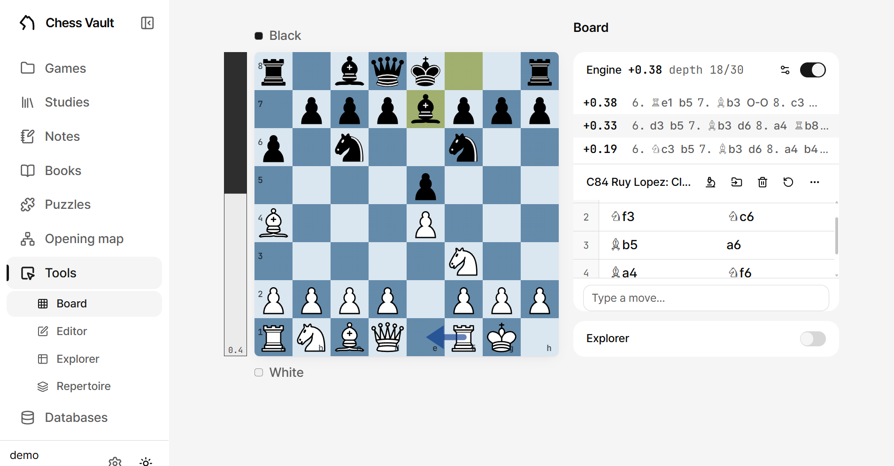
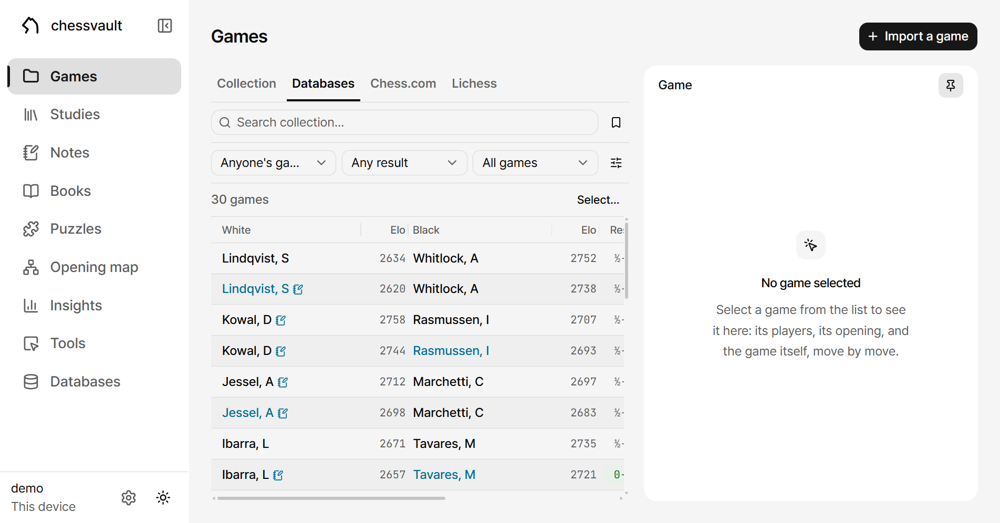
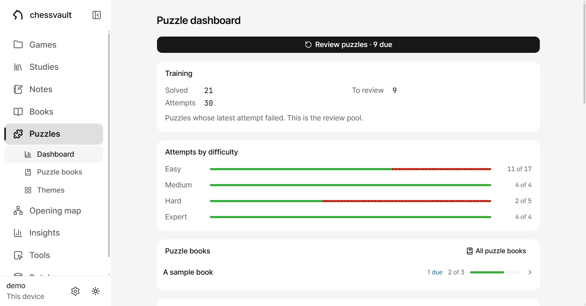
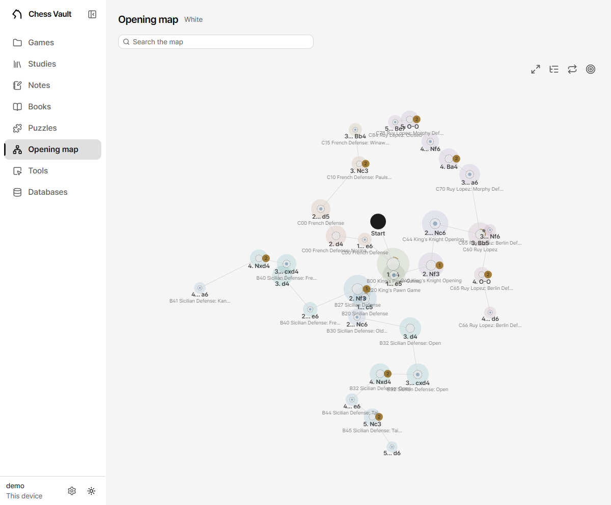

# Chess Vault

*English · [한국어](README.ko.md)*

Your chess, in plain files. A private, self-hosted chess workbench:
engine analysis, opening explorer, studies, notes, a curated game
collection, and a puzzle trainer fed by real paper books — everything
stored as PGN, markdown and JSON in one folder you own.

**Quick start:** grab the installer for Windows, macOS or Linux from
[Releases](https://github.com/chessvault-app/chessvault/releases/latest),
run it, and answer **local** when it asks where your vault lives. That is
the whole setup. [Two ways to run it](#two-ways-to-run-it) has the
details — and the second way, for when you want the same vault on every
device.

**The idea comes from Obsidian.** Two things about it are worth keeping
for chess, and this app is built on both.

*Everything is a plain file, on your own disk.* The vault is a folder —
PGN, markdown, JSON — that any editor can open and any backup tool can
copy. There is no database holding your work hostage, no export step, and
nothing that stops being readable if this app does. The parts that ARE
databases (the puzzle pool, reference games, indexes) are all derived: they
live apart from the vault, and any of them can be deleted and rebuilt.

*Everything can point at everything else.* A note links a study, a study
links a game, a game links back to the note where you worked out what
went wrong — with the same `[[wiki-links]]` Obsidian uses, resolved
across all three. Chess material is not a pile of separate documents; it
is one connected body of work, and the links are what make it that.



## Features

- **Board** — free analysis with Stockfish 18 (WASM, multi-threaded),
  full move trees with variations, comments, NAGs (`!`, `?!` and the
  rest of the annotation glyphs) and arrows, an
  opening explorer (local databases + Lichess), game review with accuracy
  and honest brilliancy detection, and position loading from FEN, PGN,
  or a *photo/screenshot* of any board.
- **Editor** — set up any position; drag pieces from the palette, or
  import from an image.
- **Studies** — PGN chapter studies with variations, per-move comments,
  NAGs and drawn arrows; the pieces move whether you're reading or
  annotating, and the annotating toggle keeps the board uncluttered when
  you're just stepping through. Import a PGN file, paste one, or pull
  studies straight from a Lichess account. You save when you choose to
  (auto-save is a setting, off by default), with an unsaved badge, a
  question on the way out, and a copy parked in the vault so a browser
  that dies doesn't take the work with it. Writes are atomic, and saving
  is a codec round-trip that `shared/pgn.test.ts` asserts is lossless
  *and* idempotent — a lossy codec would quietly erode a vault.
- **Notes** — markdown notes with embedded interactive boards
  (```` ```chess ```` fences) and Obsidian-style `[[wiki-links]]`
  across notes, studies and games. Files stay Obsidian-readable.
- **Games** — a curated collection (annotatable like studies), your
  chess.com / Lichess archives browsed month by month with filters,
  manual PGN import, and a searchable reference database of elite
  games.

  

- **Puzzles** — a lichess-themed trainer with difficulty bands and a
  progress dashboard, plus **book puzzles**: hand a scanned tactics
  book PDF to the importer (in the app: Puzzles → Books → Import a
  book) and an ML pipeline reads the diagrams,
  parses the printed solutions, verifies them by replay, and imports
  each puzzle with an honest fidelity tier and a one-click peek at the
  original page scan. No book is bundled: you supply the PDF of a book
  you own, and the puzzles it yields stay in your vault.

  

- **Tools** — the interactive boards, grouped: the analysis **Board**,
  the position **Editor**, a shortcut into the opening **Explorer**, and
  a **Repertoire** trainer that plays an opening against the field — the
  Lichess database filtered to a rating band, or any local reference database,
  the bundled one included, so it works offline (weighted-random replies,
  seamless hand-off to the engine when the line leaves book) — or drills
  one of your studies against that same field, remembering what you
  fumble ([how it works](docs/repertoire.md)).
- **Opening map** — your preparation as a constellation: you place the
  moves that define your repertoire, one map per colour, and link the
  studies and notes that cover them. Everything below a linked study is
  derived live from that study rather than stored, so coverage, depth
  and drill health are always the truth. Point it at a field — your own
  games, the Lichess database, a local reference database — and it sizes
  each move by how often it is actually played, badges the replies you
  have no answer for, and lights the line the field walks from whatever
  you select or search for ([how it works](docs/opening-map.md)).

  
- **Your own games, in the explorer.** Alongside the reference databases and the
  Lichess databases, the explorer has a **My games** source: every game
  in the vault, answering *what have I played here, and how did it go* —
  filtered by which side you had, whether you won, the speed, and the
  date. There is nothing to build and nothing to rebuild; games count
  the moment you collect them, and a listed game opens on the board.
- **Home** — the landing page leads with what you were last doing, and
  is yours to arrange: pick which destinations get a tile and in what
  order, and switch the Continue and setup cards on or off. Anything
  switched off keeps a button in the row underneath, so nothing can be
  arranged out of reach. The arrangement is stored in the vault, so
  every device that opens it agrees.
- **Settings** — change the app password, turn on authenticator 2FA,
  set your display name and platform usernames, pick a board theme and
  piece set, manage the Lichess token, or wipe the vault — all in the
  app, no shell needed.
- **Everywhere** — responsive down to phones, installable as a PWA
  (home-screen icon, splash screens, offline shell), and a desktop app
  (Windows, macOS and Linux installers) that keeps the vault on that
  machine by default, or runs as a client to your server. On a phone the
  bottom bar turns into the open page's controls (move navigation, puzzle
  actions), chess.com/Lichess-style.

Keyboard: `←` `→` step through moves · `↑`/`Home` start · `↓`/`End`
end · `f` flip board.

## Two ways to run it

Both run the same code. The only question is **where the vault lives** —
the folder holding your games, studies, notes and puzzles.

| | **On this machine** | **On a server** |
| --- | --- | --- |
| vault lives | on your computer | on one small Linux box |
| you reach it from | that computer | phone, laptop, desktop — all clients |
| needs | nothing | a machine that stays on, and HTTPS |
| updating it | install a new app | `bash scripts/deploy.sh` |

Pick the second only if you want the same vault from more than one device.
Nothing is lost by starting with the first: the vault is a folder, so
moving to a server later is copying it there.

### A · On this machine

**Download the app** for Windows, macOS or Linux from
[Releases](https://github.com/chessvault-app/chessvault/releases/latest)
and install it. Nothing else is needed — no Node, no terminal.

On first run it asks where your vault lives. Choose **local** — the app
starts the server itself and everything stays on this machine. (The other
answer, *remote*, makes the same app a window onto a server you host; see
B.) Then it asks which folder:

- **App-managed vault** — it picks one in your user profile and gets on
  with it.
- **Open a folder…** — any folder becomes your vault, including one you
  already have. Derived data (reference databases, indexes) lives inside that
  folder too, so moving or syncing the folder takes everything with it.

Updates arrive through the app itself, from those same releases.

**First minutes, once it opens:** put your chess.com / Lichess usernames
into Settings and the Games page starts browsing your archives; open
Puzzles and accept the database it offers to fetch, and the trainer is
ready. The Lichess token ([below](#lichess-token-optional)) is only
needed when you want the online extras.

To build the installer yourself, or run from the source tree:

```bash
npm install
npm run desktop:package        # or :mac / :linux — the installer
# ...or no installer at all:
npm run build                  # web app -> dist/
npm start                      # http://127.0.0.1:8787
```

From source the vault is `vault/` in the repo unless `CHESS_VAULT_DIR`
says otherwise. No password is needed — nothing is listening beyond your
machine.

### B · On a server

One box owns the vault; every device is a client. Needs **Node 22.12 or
newer** (24 is what CI and the reference deployment run) and a git
checkout somewhere durable:

```bash
# on the server, once
sudo git clone https://github.com/chessvault-app/chessvault /srv/chess-vault-app
cd /srv/chess-vault-app
npm ci
npm run build                          # web app -> dist/
CHESS_VAULT_DIR=/srv/chess-vault npm run start   # try it in the foreground
```

That last line runs it in your shell, which is fine for a first look and
no good afterwards. Give it a service — `scripts/deploy.sh` restarts one
by name, and these paths are the defaults it expects:

```ini
# /etc/systemd/system/chess-vault.service
[Unit]
Description=Chess Vault server
After=network.target

[Service]
Type=simple
User=ubuntu
WorkingDirectory=/srv/chess-vault-app
Environment=CHESS_VAULT_DIR=/srv/chess-vault
Environment=NODE_ENV=production
ExecStart=/usr/bin/npm run start
Restart=always
RestartSec=3

[Install]
WantedBy=multi-user.target
```

```bash
sudo systemctl enable --now chess-vault
```

One port serves the built app and the HTTP API together. Then:

1. **Put HTTPS in front.** A reverse proxy is not optional in practice:
   the PWA install and Stockfish's multi-threading both need a secure,
   cross-origin-isolated page. Any proxy does; with Caddy it is two lines
   and the certificate is automatic:

   ```caddy
   vault.example.com {
       reverse_proxy 127.0.0.1:8787
   }
   ```

   A [Tailscale](https://tailscale.com) tailnet is the other way — it
   gives the machine an HTTPS name without exposing it to the internet at
   all, which is what the reference deployment uses.
2. **Turn on the lock screen.** Set an app password in Settings (or
   `appPassword` in `vault/config.json`), and add authenticator 2FA
   while you are there. Anything reachable from the internet needs this.
3. **Connect your devices.** Phone: open the URL and Add to Home Screen —
   it installs as a PWA with an offline shell. Desktop: install the app
   and choose *remote* mode with your server's URL.

Settings shows two version numbers, and they are different things: the
**server** version is the web app and API you are connected to; the
**desktop app** version is the Electron window around it. In local mode
they always match, because one installer contains both. In remote mode
they are independent, and differing is normal.

**Updating the server** is one command from your workstation:

```bash
cp scripts/deploy.env.example scripts/deploy.env   # set CHESS_VAULT_HOST
bash scripts/deploy.sh
```

It builds the web app locally (the heaviest step — a 2 GB box can OOM
under it), ships the commit and the built `dist/`, runs `npm ci`, refreshes
database indexes, restarts the service and asserts it came back. It never
touches the vault.

Keep SSH off the public internet. The reference deployment runs on a
[Tailscale](https://tailscale.com) tailnet with port 22 closed at the
firewall, and `deploy.sh` reaches it over the tailnet.

Backups are layered: the server auto-commits every vault change to
`vault/.history.git` (fine-grained undo), your host's snapshots guard
against instance loss, and `scripts/backup-vault.sh` pulls the whole vault
— history included — to any machine for an off-cloud copy.

## Optional data

The app runs with an empty `data/`. These three datasets light up specific
features; everything under `data/` is derived, gitignored and rebuildable,
so it never ships in the repo. Build what you want, per machine — and
**all of it from inside the app**. The `npm run` commands below are the
terminal alternative, not the requirement.

| Dataset | Lights up | Built by |
| --- | --- | --- |
| `data/puzzles.sqlite` | the puzzle trainer | in the app, or `npm run build:puzzles` |
| `data/refgames/*.sqlite` | the elite browser, the local explorer and the repertoire trainer | a starter set comes with the app; more in the app, or `npm run build:refgames` |
| `data/openings.json` | ECO opening names | the app, on first use |

`data/mygames.sqlite` is not in the table because you never build it: the
explorer's **My games** source indexes the vault's own games itself and
keeps up as you collect more. `data/openings.json` is in it only to say
where the names come from — the server compiles it from the ECO tables it
ships with, the first time something asks for a name.

**The installer bundles a starter database**, so a fresh desktop
install answers from the first minute instead of showing empty pages.
A *reference database* is whole games plus a position index in one
SQLite file: the games are searchable by player, opening, ECO,
tournament, result and rating in the Games tab (any of them openable on
the board), and the position index is what the local explorer and the
repertoire trainer answer from — filterable, because the games survive
beside it. The bundled set keeps the strongest games of every opening
from a recent Lichess Elite month: 38,977 games, CC0, indexed to move
15. It is copied into `data/` the first time the app runs and is an
ordinary file after that: delete it, build over it. Deleting is final;
it is not put back. (Earlier releases also bundled a summed-away
"opening book"; the position index replaced it — one artifact answers
both questions now, and answers them filtered.)

It is built when a release is cut, not kept in the repo, so each
release carries data from a month that was current then. **A server
install and a source checkout have none of it** — they take the commit, not
the release artefacts — and start with an empty explorer and an empty
game browser. **When you outgrow the starter, build your own** — that
is the ordinary way round anyway: upload your PGN collections on the
Databases page and press Build. Neither `deploy.sh` nor the app
downloads games for this; only the release workflow does.
(`npm run build:bundled-refgames` shrinks data you already have into
what an installer carries — it is for packaging installers by hand, not
for getting your first database.)

**Building needs no shell.** Open the Databases page, upload your PGN
collections, tick the ones to merge and press Build. Good free sources:
[Lumbra's Gigabase](https://lumbrasgigabase.com/en/) "OTB Elite" and the
[Lichess Elite Database](https://database.nikonoel.fr/) — the second is
CC0, the first CC BY-NC-SA 4.0, which is fine for a database you build
for yourself and not for one you pass on. Positions are keyed by a
64-bit Zobrist hash — one month of Lichess Elite (280,059 games) builds
in ~100 s and its position index (8.3 M rows to move 15) in a further
~80 s.

**From a terminal, if you prefer one.**

```bash
# one month of Lichess Elite — CC0, ~80 MB zipped, ~280 k games
curl -O https://database.nikonoel.fr/lichess_elite_2025-11.zip
unzip lichess_elite_2025-11.zip -d vault/sources/

# the full database, position index included: ~540 MB, ~3 min
npm run build:refgames -- lichess_elite_2025-11.pgn
```

### The two big ones

**The puzzle trainer builds itself, in the app.** Open Puzzles with no
database and it offers to fetch one: the CC0 Lichess dump (~304 MB, 6.1 M
puzzles) downloads with a progress bar and becomes a 2.6 GB database — 115 s
of building here, after the download. Nothing to install, nothing to type,
and it keeps going if you leave the page. `npm run build:puzzles` does the
same thing from a terminal if you prefer one.

**Reference games build in the app too, and they are plural.** The
desktop starts seeded — the installer's starter set is one
database, in place before the app first opens — and the elite browser's
manager uploads PGN collections and indexes any selection of them into a
named database beside the others: an Elite month, an OTB collection,
your club's games, each searchable on its own and switchable in the
browser. Replacing one is therefore not a special case — build the same
name again, or a new name, and delete what you no longer want. The same
indexer runs from a terminal, if you prefer one:

```bash
npm run build:refgames                       # everything in vault/sources
npm run build:refgames -- elite.pgn --name elite
```

Builds land by rename, so a running server keeps serving until they do.
A deleted database is gone for good, like the bundled starter.

Running **on a server**: the puzzle build streams a 304 MB compressed dump
into a 2.6 GB database, and it will OOM on a small instance — it did on a
2 GB one here. Press the button on a machine with the memory, or build on
your workstation and `scp` the file into the server's data directory
(`CHESS_VAULT_DATA`, default `data/` beside the app). That is a question
about the machine, not about servers.

Every later deploy keeps their indexes current on its own, so rebuild only
for a newer dump or more games.

[docs/databases.md](docs/databases.md) covers rebuilding them, and the
one wrinkle that still wants a terminal: replacing a puzzle database
that already works, since that build's offer appears only when there is
none.

## It never calls anyone but your own server

No CDNs, no telemetry, no third-party requests at runtime: fonts, icons,
WASM and CSS are all bundled. The only features that reach outside are
*imports* — one-time by nature — and the optional Lichess explorer
augmentation, which you can leave off.

**With no network at all: yes.** That is the default arrangement — the
app and the vault both on your machine — and nothing about it needs the
internet. Engine, reference databases, puzzles, your whole collection.

If you have moved the vault to a server (way B), you need to be able to
reach that server. The PWA keeps its shell offline so the app still opens,
but your games and studies live on the other end of the connection. That
is a trade you make deliberately, in exchange for the same vault on every
device.

## Layout

```
shared/     pure TS: move tree + PGN codec (the core everything reuses)
server/     Hono server: vault I/O, auth gate + 2FA, settings, proxies
web/        Vite + React UI
desktop/    Electron shell (remote-client or self-hosted)
scripts/    builders: engine setup, refgames index, ML pipeline
data/       DERIVED — rebuildable, gitignored
vault/      YOUR DATA — plain files, git-friendly
```

**`vault/` is the irreplaceable part.** Everything in `data/` can be
deleted and rebuilt. Backing up or migrating is copying a folder.

## Developing

```bash
npm install
npm run dev          # server + web with hot reload, http://localhost:5173
```

First run downloads the Stockfish engine assets (7 MB lite build;
`npm run setup:engine -- --full` swaps in the full-strength one).

## Lichess token (optional)

Powers the *online* explorer augmentation, the Repertoire trainer's
Lichess source, and importing studies from a Lichess account. Create one at
[lichess.org/account/oauth/token/create](https://lichess.org/account/oauth/token/create)
with **no scopes ticked** (add `study:read` for private studies,
`puzzle:read` for Lichess puzzle-history import). Paste it into the
Settings page, or put it in `vault/config.json` (gitignored):

```json
{ "lichessToken": "lip_..." }
```

`config.json` also holds `appPassword` and the 2FA `totpSecret` when the
lock screen is on — the Settings page manages all three, and the vault's
history repo deliberately excludes the file so secrets never enter it.

## Commands

```bash
npm run dev            # server + web with hot reload
npm run build          # production build to dist/
npm start              # serve the built app
npm test               # unit tests
npm run typecheck      # tsc --noEmit
npm run setup:engine   # copy Stockfish into web/public/engine/
npm run build:bundled-refgames # curate reference games into the starter set an installer ships
npm run build:openings # recompile ECO names (the app does this itself)
npm run build:refgames # build a reference database (games + position index)
npm run build:puzzles  # build the puzzle trainer's pool from the Lichess dump
npm run desktop:package        # Windows installer (:mac, :linux for the others)
npm run desktop:package:mac    # macOS dmg (needs a Mac, or GitHub Actions)
npm run desktop:package:linux  # Linux AppImage + deb
npm run desktop:release        # check, tag, push — GitHub builds the installers
```

Server-side, from your workstation: `bash scripts/deploy.sh` updates a
server, `bash scripts/backup-vault.sh` pulls its vault down.

## Documentation

- [Architecture](docs/architecture.md) — the plain-files vault, the
  process split, the HTTP-only client rule.
- [Design principles](docs/design-principles.md) — the color grammar,
  layout rules, and other standing decisions.
- [Book import pipeline](docs/book-import-pipeline.md) — how PDFs
  become verified puzzle books, with a runbook.
- [Prepared databases](docs/databases.md) — the puzzle and reference-game
  databases: built once, copied to the server, rarely touched again.
- [The repertoire trainer](docs/repertoire.md) — free play and drilling,
  and exactly how the drill decides hit, miss and gap.
- [The opening map](docs/opening-map.md) — your repertoire as a tree:
  hand-placed moves, tagged studies, coverage derived live.
- [Explaining the engine](docs/explaining.md) — tablebase verdicts and
  per-piece values: the two engine answers that are proofs, not
  readings.
- [ML history](docs/ml-history.md) — how the book reader got good.
- [Update log](docs/update-log.md) — what changed, newest first.

## Licensing

Third-party code, data and assets — what is bundled and under what terms —
are listed in [THIRD-PARTY.md](THIRD-PARTY.md). Every npm package is
covered too, generated at build time into `licenses/dependencies.txt` and
browsable in the app under Settings → Licences.

Copyright © 2026 the Chess Vault authors.

This project is licensed under **GPL-3.0** (see [LICENSE](LICENSE)) —
the choice is effectively made by its bundled dependencies: Stockfish
and Stockfish.js are GPLv3. `chessops` and
`chessground` are AGPL/GPL — same caveat. The Lichess puzzle database
the app downloads is CC0.
