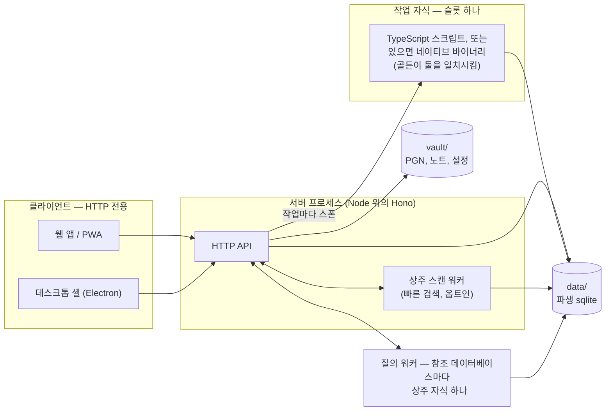

# 아키텍처

*[English](architecture.md) · 한국어*

Chess Vault는 오프라인을 우선하는 개인용 체스 작업 공간입니다. 분석 보드,
포지션 편집기, 스터디, 노트, 손수 고른 게임 모음, 그리고 퍼즐 훈련(Lichess식
테마에 더해 ML로 가져온 종이책)이 들어 있습니다. 한 사람이 쓰는 도구이지만,
어느 기기 하나보다 오래 남도록 만들었습니다.

## 타협하지 않는 한 가지: 보관함은 평범한 파일이다

```
vault/
  config.json         앱 비밀번호 + TOTP 비밀키 + Lichess 토큰, 모드 0600
  sessions.json       살아 있는 로그인 세션의 해시 (server/auth.ts)
  studies/            *.pgn        (챕터 = 파일 하나 안의 여러 게임)
  notes/              *.md         (마크다운 + ```chess 펜스 보드)
  games/
    collection/       *.pgn        (손수 고른, 주석 가능한)
    chesscom/<user>/  YYYY-MM.pgn  (기보 캐시)
    lichess/<user>/   YYYY-MM.pgn
  puzzlebooks/<id>/                  (b + 16진수 16자리, 제목은 book.json에)
    book.json  puzzles.json  drafts.json  progress.json  ocr.json  cycles.json
    diagrams/  *.jpg          (근거 스캔, 표지)
  books/.collections.json            (목록의 폴더, 이름으로)
  books/<id>/                        (목록: 보드 옆에서 읽는 PDF)
    book.pdf   book.json  reading.json  cover.jpg  diagrams.json
                          (book.json에 책이 든 폴더 이름이 있으면 적히고,
                           book.pdf은 .history.git에서 제외)
  puzzles/            history.jsonl  state.json
  repertoire/         history.jsonl  (드릴 기록)
                      map.json       (오프닝 맵, 색마다 트리 하나)
  sources/            참고용 PGN 덤프 (참고 게임 색인의 입력)
  .welcomed           표식: 환영 스터디와 노트는 한 번만 심었으니, 지우면 지워진 채로 남는다
  .history.git        자동 커밋 히스토리 저장소 (세밀한 되돌리기, config.json과 sessions.json 제외)
```

잃으면 아까울 만한 것은 전부 다른 도구도 읽을 수 있는 파일입니다. 노트는
Obsidian 호환 마크다운이고(위키 링크 `[[...]]` 포함), 스터디와 게임은 표준
PGN이며, 퍼즐 진행 상황은 JSON 라인입니다. 이 앱은 Obsidian에서 체스를
다루던 방식의 후계자이고, 그 내력은 향수가 아니라 설계 제약입니다. 진실의
원천이 되는 데이터베이스도, 독자 규격 형식도 두지 않습니다. 파생 데이터(참고
게임 sqlite, 엔진 캐시, `data/` 아래의 ML 산출물)는 언제나 다시 만들 수
있습니다.

`data/mygames.sqlite`가 이 원칙과 어긋나지 않는 이유도 여기에 있습니다.
탐색기는 보관함의 PGN 파일을 색인해(`server/myGames.ts`) "이 포지션에서 나는
무엇을 뒀는가"에 답합니다. 포지션·수·게임마다 한 행씩 두기 때문에 이제는
사라진 오프닝 북처럼 미리 합산해 두지 않고, 색·결과·시간제·날짜로 걸러서
물어볼 수 있습니다. 색인은 게임이 아닙니다. 바뀐 파일을 알아채 그 파일만
다시 색인하고, 지워도 한 번 다시 만들면 그만입니다. 디스크의 PGN이 여전히
유일하게 중요한 것입니다.

## 프로세스

앱 전체를 누가 누구와 통신하는가로 그리면 이렇습니다. 모든 클라이언트는
서버 하나에 HTTP로 요청하고, 디스크를 건드리는 것은 서버뿐입니다.



- **서버** (`server/`, Node 위의 Hono): 보관함 파일에 대한 HTTP API와 빌드된
  웹 앱의 정적 서빙을 담당합니다. 단순한 보관함 입출력 외에 선택적 인증
  게이트(비밀번호 + 인증 앱 2FA/TOTP, `server/auth.ts` + `server/totp.ts`),
  설정 API(`server/settings.ts`), 그리고 Lichess 탐색기와 스터디 내보내기
  엔드포인트로 나가는 프록시(`server/lichess.ts`), 그리고 엔드게임
  테이블베이스로 나가는 프록시(`server/tablebase.ts`)를 소유합니다.
  테이블베이스 프록시는 `TablebaseProbe` 인터페이스 뒤에 있고, 보관함의
  `tablebaseUrl`이 Lichess의 공개 Syzygy 서버나 직접 띄운 서버를
  가리킵니다. `tablebaseDir`이 Syzygy 파일이 든 폴더를 가리키면 서버를
  거치지 않고 네이티브 코어의 상주 테이블베이스 모드가 그 파일을 읽어
  답합니다(`server/tablebaseNative.ts`). 두 프록시 모두
  `CHESS_VAULT_DATA` 아래 디스크에 캐시하며, 탐색기 쪽은 만료가 있고
  테이블베이스 쪽은 없습니다. 테이블베이스는 엔드포인트마다 하위 폴더를
  따로 쓰는데, 두 서버가 같은 표를 가지고 있으리라는 법이 없기 때문입니다.
  브라우저의 Stockfish가 스레드를 쓸 수 있도록 COOP/COEP를 설정합니다.
  `CHESS_VAULT_DIR` / `CHESS_VAULT_DATA`로 보관함과 데이터 위치를 바꿀 수
  있고, 서버가 부팅할 때 보관함 뼈대를 만들어 주므로 빈 폴더를 가리켜도
  동작합니다.
- **웹 앱** (`web/`, React + Vite + Tailwind v4 + shadcn/ui + zustand):
  사용자가 만지는 모든 것. 체스 로직은 `chessops`, 보드는 chessground, 노트는
  TipTap, 엔진은 stockfish.js(WASM, 스레드)를 씁니다. 컴포넌트 층은 shadcn의
  것입니다. 레지스트리의 파일을 가져와 이 앱의 얼굴을 입힌 것이
  `web/src/components/ui`(밑은 Base UI)에, 앱의 합성 컴포넌트가
  `web/src/components`에 있고, 테마는 앱의 OKLCH 사다리에서 파생한 shadcn
  토큰 어휘로 적혀 있습니다(`docs/design-principles.ko.md`의 "컴포넌트 층"
  참고). 서버와는 **오직** HTTP로만 주고받습니다. 데스크톱, PWA, 휴대폰 등
  모든 접점을 얇은 클라이언트로 유지하는 엄격한 규칙입니다. 휴대폰에서는
  상황에 따라 바뀌는 하단 바(`web/src/components/mobile-action-bar.tsx`)가
  전역 탭 대신 열려 있는 페이지의 조작 버튼을 보여 줍니다.
- **작업 자식 프로세스** (서버가 띄우며, 인프로세스로는 실행하지 않습니다.
  일부러 둔 예외 둘은 아래에 있습니다): 참고 데이터베이스 빌드, 포지션
  색인, 최적화, 모든 게임에서 포지션 찾기 같은 무거운 데이터베이스 작업은
  API가 계속 응답할 수 있도록 자식 프로세스로 실행됩니다. 작업 슬롯은
  하나이고, 자식의 stdout이 진행 로그입니다. 각 작업은 서로 일치해야
  하는 구현을 둘 가집니다. TypeScript 쪽(`scripts/*.ts`, 또는 패키징된
  서버 옆의 번들 `.mjs`)과, 빌드해 둔 것이 있으면 서버가 먼저 고르는
  `native/`의 Rust 바이너리입니다. 둘은 고정 답안(JS 쪽에서 내보낸
  `native/tests/goldens.json`, SQL과 공유 상수까지 포함)과 파일 전체
  비교, 그리고 푸시마다 CI가 실행하는 무작위 말뭉치 퍼즈로 바이트 단위까지
  묶여 있습니다. 전수 검색 스캔은 실행 중에도 묶여 있어, 서버가 네이티브
  적중 하나하나를 참조 스캐너로 다시 재생한 뒤에야 스트리밍합니다.
  `CHESS_NATIVE=0`은 비교를 위해 JS 경로를 고정합니다. 바이너리를
  요구하는 곳은 없습니다. 의존성이 아니라 속도를 위한 것입니다. 빌드
  방법과 테스트, 그리고 지켜야 할 규칙은 `native/README.md`에 있습니다.
  무거운 작업 하나는 일부러 자식이 **아닙니다**. 빠른 검색
  (`server/scanWorker.ts`)은 옵트인한 데이터베이스의 압축 스캔 색인을
  서버 메모리에 상주시킵니다. 데이터베이스 하나를 소유하는 워커 스레드
  하나에 요청이 줄을 서고, 30분 동안 쓰이지 않으면 내려갑니다. 요청보다
  오래 남는 상태가 그 존재 이유인데, 작업마다 띄우는 자식은 그런 상태를
  지닐 수 없기 때문입니다. 구조는 `docs/databases.ko.md`의 "검색이 답하는
  구조"에 있습니다. 두 번째 예외는 같은 모양을 다른 언어로 만든 것입니다.
  `chessvault-core tablebase`는 메모리에 매핑한 Syzygy 파일을 쥐고 있는
  **상주** 자식으로, 한 번 띄워 두고 계속 씁니다. 조회 하나마다
  프로세스를 띄우면 수백 바이트를 읽는 데 수십 밀리초가 들기 때문입니다
  (`server/tablebaseNative.ts`, `native/README.md`). 세 번째는 참조
  데이터베이스의 질의 워커(`server/queryWorker.ts`, 수명은
  `server/refgamesQuery.ts`가 관리)입니다. 데이터베이스 파일마다 자식
  프로세스 하나가 읽기 전용 연결 하나를 쥐고, 행을 훑는 문장, 즉 탐색기의
  실시간 조인과 집계, 게임 브라우저의 건수와 페이지, 이름 제안, 게임
  찾기를 도착한 순서대로 하나씩 실행하며, 서버 자체 스레드는 요청을
  넘기기만 합니다. 스레드가 아니라 프로세스인 이유는 SQLite 문장 하나가
  네이티브 호출 하나라서 스레드의 `terminate()`로는 중단할 수 없기
  때문입니다. 클라이언트가 포기한 요청은 프로세스를 죽여 멈추고, 뒤에
  줄 서 있던 것을 위해 새 프로세스를 띄웁니다. 가벼운 읽기(메타, 키
  조회, 미리 계산한 합계)는 왕복 비용이 더 크므로 메인 스레드의 핸들에
  남습니다.
- **데스크톱** (`desktop/`, Electron): 실행할 때 두 가지 모드 중 하나를
  고릅니다. *원격 클라이언트*(서버 URL을 가리킴)와 *자체 호스팅*(동봉한
  서버를 로컬 폴더에 대해 띄움)입니다. UI가 HTTP 전용이므로 셸은
  아키텍처가 아니라 포장입니다. IPC가 아주 없지는 않습니다. 설정 페이지가
  있는지 확인한 뒤 쓰는 좁은 선택적 다리(`window.vaultShell`,
  desktop/preload.cjs)가 있어, 보관함 바꾸기, 업데이터, 그리고 보관함이나
  테이블베이스 파일 폴더를 고르는 네이티브 대화 상자를 맡습니다. 그 뒤에
  있는 것 중 **동작**은 하나도 없고, 거기서 나온 값도 모두 같은 HTTP API로
  서버에 갑니다. 다리가 없는 브라우저에서는 그 조작들이 표시되지 않을
  뿐입니다.
- **PWA**: 브라우저에서 설치한 같은 웹 앱입니다. 매니페스트 + 서비스
  워커(네트워크 우선, 캐시 대체, `/api`는 절대 캐시하지 않음), 노치를 위한
  안전 영역 처리, `scripts/render-icons.mjs`가 테마별로 만들어 내는 시작
  이미지(OS가 그리는 그 이미지가 시작 화면의 전부입니다. 페이지 안에서
  그리는 시작 화면은 시도했다가 걷어냈습니다. `web/index.html` 참고), 그리고
  코드 분할된 시작 청크를 갖췄습니다. iOS가 백그라운드로 보낸 PWA를
  처음부터 다시 띄우기 때문입니다. 분석 보드를 포함해 모든 화면이 지연
  로딩됩니다. 런처 하나를 그리자고 시작 페이지가 엔진과 탐색기와 PGN
  파서까지 불러오는 비용을 치러서는 안 되기 때문이고, 홈 화면에서 구성
  창만 지연 로딩되는 것도 같은 이유입니다. 지금 시작 페이지가 받는 JS는
  한국어로 662 kB입니다. 셸 563 kB(49개 조각: 248 kB의 진입 조각, 133 kB의
  컴포넌트 층, 63 kB의 다이얼로그)에 사전 99 kB이고, 영어로는 563 kB이며,
  0.7.2 빌드에서 측정했습니다. 컴포넌트 층이 들어오기 전의 셸은 217 kB였고,
  Base UI 이식이 컴포넌트 층과 다이얼로그 조각을 다시 키웠습니다. 새 UI
  문구는 보통 사전에만 비용을 물립니다. 0.5.0은 데이터베이스 어휘, 레벨
  구간, 전수 검색, 비교 리포트를 더했지만 셸은 1 kB도 움직이지 않았습니다.
  그러나 0.6.0은 그 말이 전부가 아니게 된 릴리스입니다. 사전은 예상대로
  96 → 102 kB로 자랐고, 셸도 503 → 516 kB로 함께 자랐습니다. 질의 언어,
  밀도 손잡이, 편집기의 페이지 사슬은 찾아보는 낱말이 아니라 런처가 받는
  코드이기 때문입니다. 0.7.0까지는 둘이 반대로 움직였습니다. 죽은 항목
  138개를 걷어내면서 사전은 102 → 95 kB로 줄었고, 셸은 516 → 542 kB로
  자랐습니다. 워크스페이스, 떼어낸 게임 브라우저, 평가 막대의 자체 패널이
  모두 코드이고, 그중 233 → 240 kB를 진입 조각이 가져갔습니다. 컴포넌트 층과
  다이얼로그 조각은 각각 2 kB쯤 움직였습니다. 0.7.2는 둘을 다시 같은 방향에
  올려놓았고, 조각 수를 왜 세는지 말해 주는 릴리스이기도 합니다. 셸은 조각
  네 개가 늘면서 542 → 563 kB로, 사전은 95 → 99 kB로 자랐습니다. 그 릴리스가
  한 일이 곧 들어올 것의 자리를 미리 잡아 두는 자리 표시자였기 때문입니다.
  예약 모듈 셋, 다시 쓴 판 넘김, 반쯤 더 커진 스켈레톤 파일 모두가 첫
  화면을 그리려고 런처가 받아야 하는 코드입니다. 그중 240 → 248 kB를 진입
  조각이 가져갔습니다. 답이 오기 *전에* 벌어지는 일에 자신을 쓴 릴리스는
  가장 먼저 도착해야 하는 조각으로 그 값을 치릅니다.

## 배포 모델

목표는 이렇습니다. 작은 리눅스 서버 한 대가 서버를 실행하고, 원격 모드의
데스크톱 앱이든 휴대폰 PWA든 모든 기기는 클라이언트입니다. 지금 쓰는 Windows
개발 머신은 임시이며, 어떤 것도 거기에 의존해서는 안 됩니다. 플랫폼 중립적인
경로와 LF 줄바꿈은 반드시 지킵니다.

배포는 `scripts/deploy.sh`로 합니다(git 번들 전송 → `npm ci` → 빌드 →
`systemctl restart chess-vault`). 이 스크립트는 준비된 데이터베이스의 색인이
유지되도록 `tune-dbs.ts`도 함께 실행합니다. SSH는 방화벽에서 공개 22번 포트를
닫은 채 Tailscale 테일넷 위에서 동작합니다.

앱 자체에 어떻게 접속하느냐는 아키텍처가 아니라 배포의 선택입니다. 공개
주소에서 HTTPS를 끝내는 리버스 프록시를 둘 수도 있고, 공개된 것 없이
Tailscale만 쓸 수도 있습니다. 둘 다 같은 서버로 가는 HTTP일 뿐입니다.

보관함과 함께 자라지 않고 한 번 미리 준비하는 데이터베이스가 둘 있습니다.
퍼즐 풀과 참고 게임입니다. 각 기기가 이들을 어떻게 갖게 되는지는
[데이터베이스](databases.ko.md)에 있습니다(둘 다 앱이 만듭니다. 퍼즐
풀은 공개 덤프에서, 참고 게임은 올려 둔 PGN 파일에서 만들고, 데스크톱 설치
프로그램은 시작용 세트까지 심어 줍니다). 데스크톱 빌드는 이 저장소의 GitHub
릴리스에서 갱신됩니다. 그것을 쓰고 싶지 않다면 서버가 `/updates`에 자기
피드를 호스팅할 수도 있습니다([desktop/README.md](../desktop/README.md)
참고).

백업은 여러 겹입니다. `vault/.history.git`(변경마다 되돌리기), 호스트
스냅숏, 그리고 호스트 밖으로 받아 두는 `scripts/backup-vault.sh`입니다.

`server/vaultHistory.ts`가 그 첫 겹을 앱에 돌려주므로 복구에 셸이 필요
없습니다. 한 문서의 버전 목록, 특정 버전의 내용, 히스토리에는 있지만
보관함에는 없는 문서 목록, 그리고 자동 저장을 먼저 강제한 뒤 `writeAtomic`으로
내용을 쓰는 복원입니다. `git checkout`은 쓰지 않습니다. 감시자가 쓰고 있는
저장소의 인덱스를 건드리기 때문입니다. 경로는 고정된 디렉터리 표와 `validId`를
통과한 문서 id로만 만들어지므로 `studies/`, `notes/`, `games/collection/` 밖은
가리킬 수 없습니다. 데모는 `mountVault` 목록을 공유하지만 git도
`node:child_process`도 없으므로, 이 API는 `server/index.ts`에서 따로
마운트되고 히스토리가 없는 곳에서는 모든 경로가 `{ available: false }`로
답합니다.

답이 어디서 오는지는 바뀌어도 묻는 질문은 그대로입니다. `vaultHistoryApi`는
`commitNow` 옆에 선택적인 `run`과 `available`을 받고, 기본값은 히스토리
저장소입니다. 서버가 낼 수 있는 답은 그것뿐이므로 서버는 둘 다 넘기지 않고,
바뀐 것도 없습니다. 정적 데모는 자기 짝을 넘깁니다. 데모의 파일 시스템 shim은 모든
쓰기를 보므로 판본을 스스로 보관하고(쓰기마다 하나, 중복 제거, 경로당 열두 개),
같은 다섯 가지 git 명령에 이 파일이 이미 해석하는 형태로 답합니다. 여섯 번째
명령을 물으면 그럴듯한 값을 지어내는 대신 크게 실패합니다. 데모에서 이전
버전과 삭제된 문서를 볼 수 있는 것이 이 이음매 덕분이고, 그것을
보여 주는 데 이 모듈이 치른 비용이 없는 것도 같은 이유입니다.

## 공유 코드

`shared/`에는 서버와 웹이 함께 쓰는 수 트리와 PGN 코덱이 들어 있습니다.
트리, 주석, NAG, 화살표, 시계를 담는 무손실 표현 하나뿐이라, 스터디는
디스크와 서버와 UI 사이를 바이트 단위로 충실하게 왕복합니다.
