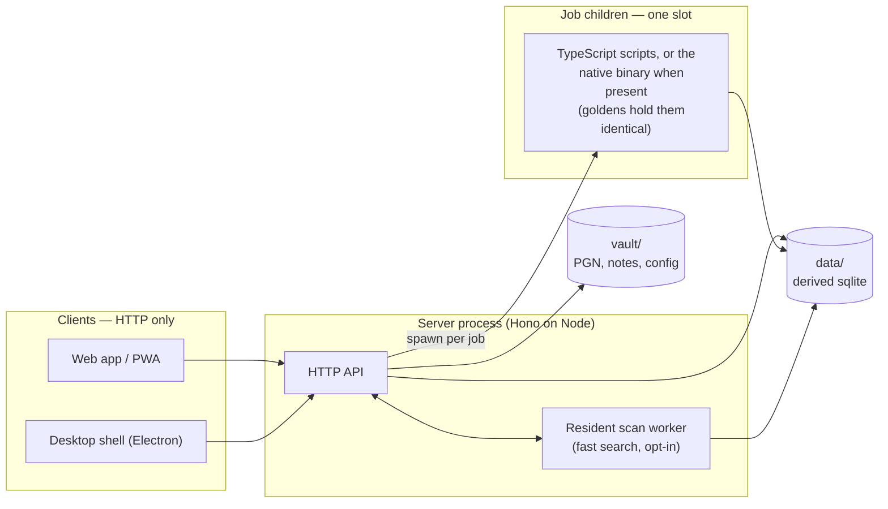

# Architecture

*English · [한국어](architecture.ko.md)*

Chess Vault is a private, offline-first chess workbench: analysis board,
position editor, studies, notes, a curated game collection, and puzzle
training (lichess-style themes plus paper books imported by ML). One
person's tool, built to outlive any one machine.

## The one non-negotiable: the vault is plain files

```
vault/
  config.json         app password + TOTP secret + Lichess token, mode 0600
  sessions.json       hashes of the live sign-in sessions (server/auth.ts)
  studies/            *.pgn        (chapters = games in one file)
  notes/              *.md         (markdown + ```chess fenced boards)
  games/
    collection/       *.pgn        (curated, annotatable)
    chesscom/<user>/  YYYY-MM.pgn  (archive cache)
    lichess/<user>/   YYYY-MM.pgn
  puzzlebooks/<id>/                  (b + 16 hex; the title lives in book.json)
    book.json  puzzles.json  drafts.json  progress.json  ocr.json  cycles.json
    diagrams/  *.jpg          (evidence scans, cover)
  books/.collections.json            (the library's collections, by name)
  books/<id>/                        (the library: a PDF you read beside a board)
    book.pdf   book.json  reading.json  cover.jpg  diagrams.json
                          (book.json names the book's collection, if any;
                           book.pdf is excluded from .history.git)
  puzzles/            history.jsonl  state.json
  repertoire/         history.jsonl  (drill history)
                      map.json       (the opening map, one tree per colour)
  sources/            reference PGN dumps (input to refgames index)
  .welcomed           marker: the welcome study and note were seeded once, so deleting them sticks
  .history.git        auto-commit history repo (fine-grained undo; excludes config.json and sessions.json)
```

Everything a person would grieve losing is a file another tool can read.
Notes are Obsidian-compatible markdown (wiki-links `[[...]]` included);
studies and games are standard PGN; puzzle progress is JSON lines. The
app is the successor to a chess-in-Obsidian workflow, and that heritage
is a design constraint, not nostalgia: no databases as the source of
truth, no proprietary formats. Derived data (the reference-game sqlite,
engine caches, ML artifacts under `data/`) is always rebuildable.

That rule is what lets `data/mygames.sqlite` exist without contradicting
it. The explorer answers "what have I played here" from an index over the
vault's PGN files (`server/myGames.ts`) — one row per position, move and
game, so the question can be filtered by side, result, speed and date
rather than pre-summed the way the retired opening books were. The index is not
the games; it notices a changed file and reindexes that file alone, and
deleting it costs one rebuild. The PGN on disk stays the only thing that
matters.

## Processes

The whole app, as who talks to whom — every client speaks HTTP to the
one server, and the server is the only thing that touches disk:



- **Server** (`server/`, Hono on Node): HTTP API over the vault files,
  plus static serving of the built web app. Beyond plain vault I/O it
  owns the optional auth gate (password + authenticator 2FA/TOTP,
  `server/auth.ts` + `server/totp.ts`), the settings API
  (`server/settings.ts`), and outbound proxies to the Lichess explorer
  and study-export endpoints (`server/lichess.ts`). Sets COOP/COEP so the
  browser Stockfish can use threads. `CHESS_VAULT_DIR` / `CHESS_VAULT_DATA`
  override the vault/data locations; the server creates the vault
  skeleton on boot, so pointing it at an empty folder works.
- **Web app** (`web/`, React + Vite + Tailwind v4 + shadcn/ui + zustand):
  everything the user touches. Chess logic via `chessops`, boards via
  chessground, notes via TipTap, engine via stockfish.js (WASM, threads).
  The component layer is shadcn's: the registry's files, owned and given
  the app's face, under `web/src/components/ui` (Base UI underneath), the
  app's composites under `web/src/components`, the theme in shadcn's
  token vocabulary derived from the app's OKLCH ladder (see
  `docs/design-principles.md`, "The component layer"). Talks to the
  server over HTTP **only** — this is a hard rule that keeps every
  frontier (desktop, PWA, phone) a thin client. On phones a contextual
  bottom bar (`web/src/components/mobile-action-bar.tsx`) hands the open
  page its own controls in place of the global tabs.
- **Job children** (spawned by the server, never in-process): the heavy
  database work — building a reference database, indexing its positions,
  optimizing it, scanning every game for a position — runs as a child so
  the API stays answerable, with one job slot and the child's stdout as
  the progress log. Each has two implementations that must agree: the
  TypeScript one (`scripts/*.ts`, or the bundled `.mjs` beside a packaged
  server) and, when a build of it exists, the Rust binary from `native/`,
  which the server prefers. They are held to byte-identical output by
  golden fixtures (`native/tests/goldens.json`, exported from the JS
  side) and a whole-file diff; `CHESS_NATIVE=0` pins the JS path for
  comparing them. Nothing requires the binary — it is a speed, not a
  dependency. `native/README.md` has the build, the test and the rule.
  One heavy job deliberately is **not** a child: fast search
  (`server/scanWorker.ts`) holds an opted-in database's packed
  scan-index resident in server memory — one worker thread owning one
  database, requests queueing into it, evicted after 30 idle minutes —
  because its whole point is state that outlives a request, which a
  spawned-per-job child cannot keep. `docs/databases.md`, "How the
  search answers", has the shape.
- **Desktop** (`desktop/`, Electron): two modes chosen at launch —
  *remote client* (point at a server URL) or *self-hosted* (spawns the
  bundled server against a local folder). Because the UI is HTTP-only,
  the shell has no IPC in React code; it is packaging, not architecture.
- **PWA**: the same web app installed from the browser. Manifest +
  service worker (network-first, cache fallback, never `/api`), safe-area
  handling for notches, theme-aware startup images generated by
  `scripts/render-icons.mjs` (the OS-drawn images are the whole launch
  presentation — an in-page launch screen was tried and retired, see
  `web/index.html`), and a code-split landing chunk because iOS
  relaunches backgrounded PWAs from scratch. Every view is lazy, including
  the analysis board — the landing page must not pay for the engine, the
  explorer and the PGN parsers to draw a launcher — which is also why the
  home page's customise dialog is the one thing on it that is lazy. It
  currently loads 637 kB of JS in Korean — 542 kB of shell across 45
  chunks (the 240 kB entry, 132 kB of the component layer, 63 kB of
  dialog) and 95 kB of dictionary — and 542 kB in English; measured on
  the post-0.6.0 build. The shell was 217 kB before the component layer
  came in, and the Base UI port grew the layer's and the dialog's chunks
  again. New UI strings usually cost the dictionary and nothing else —
  0.5.0 added the Databases vocabulary, the level bands, the deep search
  and the comparison report without the shell moving a kilobyte — but
  0.6.0 is the release where that stopped being the whole story: the
  dictionary grew 96 → 102 kB as expected, and the shell grew 503 → 516
  kB with it, because the query language, the density knob and the
  editor's paged chain are code the launcher loads rather than words it
  looks up. Since 0.6.0 the two have moved in opposite directions: the
  dictionary fell 102 → 95 kB when 138 dead entries were swept out of it,
  while the shell grew 516 → 542 kB — the workspace, the extracted games
  browser and the eval bar's own panel are all code, and the entry took
  233 → 240 kB of it. The component layer and the dialog chunk moved by
  about 2 kB each.

## Deployment model

Target: a small Linux box running the server; every device —
desktop app in remote mode, phone PWA — is a client. The current Windows
dev box is temporary; nothing may depend on it. Cross-platform paths and
LF endings are policy.

Ship with `scripts/deploy.sh` (git-bundle push → `npm ci` → build →
`systemctl restart chess-vault`), which also runs `tune-dbs.ts` so the
prepared databases keep their indexes. SSH runs over a Tailscale tailnet
with public port 22 closed at the firewall.

How the app itself is reached is a deployment choice, not an architectural
one: a reverse proxy terminating HTTPS on a public address, or Tailscale
alone with nothing public at all. Both are just HTTP to the same server.

Two databases are prepared once rather than grown with the vault — the
puzzle pool and the reference games; [databases](databases.md) covers how
each machine comes by them (the app builds both — the puzzle pool from
the public dump, reference games from uploaded PGN collections — and the
desktop installer seeds starters besides). Desktop builds
update from this repository's GitHub releases; a server can host its own
feed at `/updates` instead, for anyone who would rather not use them
(see [desktop/README.md](../desktop/README.md)).

Backups are layered: `vault/.history.git` (per-change undo), host
snapshots, and `scripts/backup-vault.sh` for an off-host pull.

`server/vaultHistory.ts` serves that first layer back to the app, so
recovery never needs a shell: the versions of one document, any version's
bytes, the documents the history remembers and the vault no longer has,
and a restore that writes the blob through `writeAtomic` after forcing an
autosave — never `git checkout`, which would move the repo's index under
the watcher. Paths are built from a fixed directory table plus a
`validId` document id, so nothing outside `studies/`, `notes/` and
`games/collection/` is addressable. It is mounted in `server/index.ts`
rather than `mountVault`, because the demo shares that list and has
neither git nor `node:child_process`; every route answers
`{ available: false }` where there is no history to read.

## Shared code

`shared/` holds the move-tree and PGN codec used by both server and web:
one lossless representation for trees, comments, NAGs, arrows and clocks,
so a study round-trips byte-faithfully between disk, server and UI.
