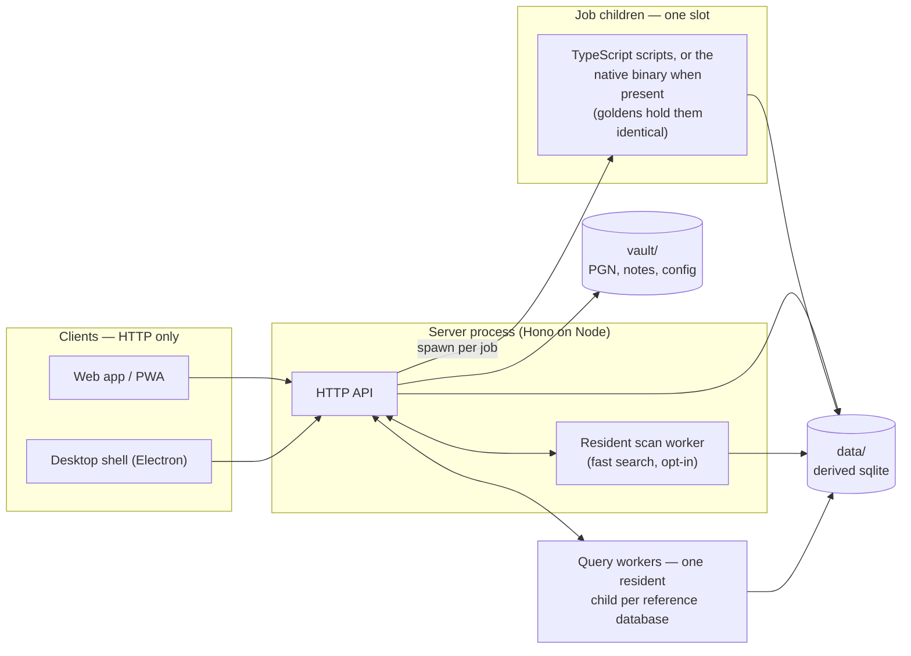

# Architecture

*English · [한국어](architecture.ko.md)*

Chess Vault is a private, offline-first chess workbench: analysis board,
position editor, studies, notes, a curated game collection, and puzzle
training (Lichess-style themes plus paper books imported by ML). One
person's tool, built to outlive any one device.

## The one non-negotiable: the vault is plain files

```
vault/
  config.json         app password + TOTP secret + Lichess token, mode 0600
  sessions.json       hashes of the live sign-in sessions (server/auth.ts)
  activity.jsonl      what was done and when: studies, notes, games, books
                      (the two trainers keep their own, below; server/activity.ts)
  studies/            *.pgn        (chapters = games in one file)
  notes/              *.md         (markdown + ```chess fenced boards)
  games/
    collection/       *.pgn        (curated, annotatable)
    chesscom/<user>/  YYYY-MM.pgn  (archive cache)
    lichess/<user>/   YYYY-MM.pgn
  puzzlebooks/.bookmarks.json        (the puzzle shelf's bookmarks)
  puzzlebooks/<id>/                  (b + 16 hex; the title lives in book.json)
    book.json  puzzles.json  drafts.json  progress.json  ocr.json  cycles.json
    diagrams/  *.jpg          (evidence scans, cover)
  books/.collections.json            (the shelf's folders, by name)
  books/.bookmarks.json              (the shelf's bookmarks)
  books/<id>/                        (the shelf: a PDF you read beside a board)
    book.pdf   book.json  reading.json  cover.jpg  diagrams.json  open.bin
                          (book.json names the book's folder, if any;
                           open.bin is the bytes opening the PDF needs,
                           recorded on its first open, server/pdfWarm.ts;
                           book.pdf and open.bin are excluded from
                           .history.git, and open.bin from a copy)
  puzzles/            history.jsonl  state.json
  repertoire/         history.jsonl  (drill history)
                      map.json       (the opening map, one tree per colour)
  sources/            reference PGN dumps (input to refgames index)
  .welcomed           marker: the welcome study and note were seeded once, so deleting them sticks
  .history.git        auto-commit history repo (fine-grained undo; excludes config.json,
                      sessions.json, sources/, .restore/, and *.part and *.swp files)
  .restore/           a restore from a copy at work (server/restore.ts): the upload being
                      unpacked, and the vault it replaced until that is kept or undone
```

Everything a person would grieve losing is a file another tool can read.
Notes are Obsidian-compatible markdown (wiki-links `[[...]]` included);
studies and games are standard PGN; puzzle progress is JSON lines. The
app is the successor to a chess-in-Obsidian workflow, and that heritage
is a design constraint, not nostalgia: no databases as the source of
truth, no proprietary formats. Derived data (the reference-game sqlite,
engine caches, ML artifacts under `data/`) is always rebuildable.

That rule is what lets `data/mygames.sqlite` exist without contradicting
it. The explorer answers "what have I played here" from an index over the
vault's PGN files (`server/myGames.ts`) — one row per position, move and
game, so the question can be filtered by side, result, speed and date
rather than pre-summed the way the retired opening books were. The index is not
the games; it notices a changed file and reindexes that file alone, and
deleting it costs one rebuild. The PGN on disk stays the only thing that
matters.

## Processes

The whole app, as who talks to whom — every client speaks HTTP to the
one server, and the server is the only thing that touches disk:


```mermaid
flowchart LR
  subgraph clients ["Clients — HTTP only"]
    web["Web app / PWA"]
    desk["Desktop shell (Electron)"]
  end
  subgraph srv ["Server process (Hono on Node)"]
    api["HTTP API"]
    scanw["Resident scan worker
    (fast search, opt-in)"]
  end
  subgraph jobs ["Job children — one slot"]
    impl["TypeScript scripts, or the
    native binary when present
    (goldens hold them identical)"]
  end
  vault[("vault/
  PGN, notes, config")]
  data[("data/
  derived sqlite")]
  web --> api
  desk --> api
  api --> vault
  api --> data
  api -- "spawn per job" --> impl
  impl --> data
  api <--> scanw
  scanw --> data
  qw["Query workers — one resident
  child per reference database"]
  api <--> qw
  qw --> data
```

- **Server** (`server/`, Hono on Node): HTTP API over the vault files,
  plus static serving of the built web app. Beyond plain vault I/O it
  owns the optional auth gate (password + authenticator 2FA/TOTP,
  `server/auth.ts` + `server/totp.ts`), the settings API
  (`server/settings.ts`), and outbound proxies to the Lichess explorer
  and study-export endpoints (`server/lichess.ts`) and to the endgame
  tablebase (`server/tablebase.ts`, behind a `TablebaseProbe` interface,
  pointed by the vault's `tablebaseUrl` at Lichess's public Syzygy
  server or at one of your own — or answered with no server at all,
  where `tablebaseDir` names a folder of Syzygy files and the native
  core's resident tablebase mode reads them,
  `server/tablebaseNative.ts`). Both proxies cache to disk under
  `CHESS_VAULT_DATA`; the explorer's entries expire, the tablebase's
  never do, and each tablebase endpoint gets its own subdirectory since
  two servers need not hold the same tables. It also fetches
  Stockfish's full network once, when the engine's settings ask, into
  `data/engine-nets/` and serves it to the engine as a same-origin file
  (`server/engineNets.ts`): the net server sends no CORS headers, and
  the page is cross-origin isolated. Sets COOP/COEP so the
  browser Stockfish can use threads. `CHESS_VAULT_DIR` / `CHESS_VAULT_DATA`
  override the vault/data locations; the server creates the vault
  skeleton on boot, so pointing it at an empty folder works. The skeleton
  is one list (`VAULT_SKELETON`, `server/paths.ts`), and the wipe and a
  restore leave the vault in that shape too, since no route makes its
  own folder again.
- **Web app** (`web/`, React + Vite + Tailwind v4 + shadcn/ui + zustand,
  with the React Compiler memoising every component it will take;
  `web/vite.compiler.ts` wires it and, under `CHESS_COMPILER_LOG=1`,
  reports what it refused): everything the user touches. Chess logic via `chessops`, boards via
  chessground, notes via TipTap, engine via Stockfish's WASM builds (the Lichess build of
  Stockfish 19 with threads, Stockfish 18 single-threaded without).
  The component layer is shadcn's: the registry's files, owned and given
  the app's face, under `web/src/components/ui` (Base UI underneath), the
  app's composites under `web/src/components`, the theme in shadcn's
  token vocabulary derived from the app's OKLCH ladder (see
  `docs/design-principles.md`, "The component layer"). Talks to the
  server over HTTP **only** — this is a hard rule that keeps every
  frontier (desktop, PWA, phone) a thin client. On phones a contextual
  bottom bar (`web/src/components/mobile-action-bar.tsx`) hands the open
  page its own controls in place of the global tabs.
- **Job children** (spawned by the server, never in-process — with two
  deliberate exceptions, both below): the heavy
  database work — building a reference database, indexing its positions,
  optimising it, scanning every game for a position — runs as a child so
  the API stays answerable, with one job slot and the child's stdout as
  the progress log. Each has two implementations that must agree: the
  TypeScript one (`scripts/*.ts`, or the bundled `.mjs` beside a packaged
  server) and, when a build of it exists, the Rust binary from `native/`,
  which the server prefers. They are held to byte-identical output by
  golden fixtures (`native/tests/goldens.json`, exported from the JS
  side, the SQL and the shared literals included), a whole-file diff,
  and a fuzz of the two on a random corpus that CI runs on every push;
  the deep-search scan is tethered at runtime too, the server replaying
  every native hit through its reference scanner before streaming it.
  `CHESS_NATIVE=0` pins the JS path for comparing them. Nothing requires
  the binary — it is a speed, not a dependency. `native/README.md` has
  the build, the test and the rule.
  One heavy job deliberately is **not** a child: fast search
  (`server/scanWorker.ts`) holds an opted-in database's packed
  scan-index resident in server memory — one worker thread owning one
  database, requests queueing into it, evicted after 30 idle minutes —
  because its whole point is state that outlives a request, which a
  spawned-per-job child cannot keep. `docs/databases.md`, "How the
  search answers", has the shape. The second exception is the same shape
  in the other language: `chessvault-core tablebase` is a RESIDENT child
  holding memory-mapped Syzygy files, spawned once and kept, because a
  process started per lookup would spend tens of milliseconds to read a
  few hundred bytes (`server/tablebaseNative.ts`, `native/README.md`).
  The third is the reference databases' query workers
  (`server/queryWorker.ts`, owned by `server/refgamesQuery.ts`): one
  child process per database file, holding one read-only connection
  and running the statements that scan rows — the explorer's live join
  and aggregation, the games browser's count and page, name
  suggestions, the game lookup — one at a time, in order, while the
  server's own thread only routes. A process and not a thread because
  a SQLite statement is one native call that a thread's `terminate()`
  cannot interrupt: a request the client abandons is stopped by killing
  the process, and a fresh one is forked for whatever was queued behind
  it. The cheap reads (meta, a lookup by key, the precomputed sums)
  stay on the main thread's own handle, where a round trip would cost
  more than they do.
- **Desktop** (`desktop/`, Electron): two modes chosen at launch —
  *remote client* (point at a server URL) or *self-hosted* (spawns the
  bundled server against a local folder). Because the UI is HTTP-only,
  the shell is packaging, not architecture. What IPC exists is a narrow,
  optional bridge (`window.vaultShell`, desktop/preload.cjs) that
  Settings feature-detects: switching vault, showing the vault's folder
  in the system's file manager, the updater, the native folder dialog
  for choosing a vault or a folder of tablebase files, the window
  commands behind the title bar the page draws (`components/title-bar`:
  back, forward, the ☰ menu's reload, zoom and quit), and the window's
  own dress: the title band's colours, and the material Windows 11 or
  macOS can draw behind the window (Settings → Desktop app, off by
  default).
  Nothing behind it is BEHAVIOUR — a value it produces either dresses
  the window or goes to the server over the same HTTP API — and a
  browser, where the bridge is absent, simply does not draw those
  controls.
- **PWA**: the same web app installed from the browser. Manifest +
  service worker (network-first, cache fallback, never `/api`), safe-area
  handling for notches, theme-aware startup images generated by
  `scripts/render-icons.mjs` (the OS-drawn images are the whole launch
  presentation — an in-page launch screen was tried and retired, see
  `web/index.html`), and a code-split landing chunk because iOS
  relaunches backgrounded PWAs from scratch. Every view is lazy, including
  the analysis board — the landing page must not pay for the engine, the
  explorer and the PGN parsers to draw a launcher — which is also why the
  home page's customise dialog is the one thing on it that is lazy. The 0.7.2
  build loaded 662 kB of JS in Korean — 563 kB of shell across 49
  chunks (the 248 kB entry, 133 kB of the component layer, 63 kB of
  dialog) and 99 kB of dictionary — and 563 kB in English. The shell was 217 kB before the component layer
  came in, and the Base UI port grew the layer's and the dialog's chunks
  again. New UI strings usually cost the dictionary and nothing else —
  0.5.0 added the Databases vocabulary, the level bands, the deep search
  and the comparison report without the shell moving a kilobyte — but
  0.6.0 is the release where that stopped being the whole story: the
  dictionary grew 96 → 102 kB as expected, and the shell grew 503 → 516
  kB with it, because the query language, the density knob and the
  editor's paged chain are code the launcher loads rather than words it
  looks up. Through 0.7.0 the two moved in opposite directions: the
  dictionary fell 102 → 95 kB when 138 dead entries were swept out of it,
  while the shell grew 516 → 542 kB — the workspace, the extracted games
  browser and the eval bar's own panel are all code, and the entry took
  233 → 240 kB of it. The component layer and the dialog chunk moved by
  about 2 kB each. 0.7.2 put both back on the same direction, and it is
  the release that says what a chunk count is for: the shell grew 542 →
  563 kB across four more chunks and the dictionary 95 → 99 kB, because
  the work of that release was placeholders that reserve what is coming
  — three reservation modules, a rewritten pane swipe, a skeleton file
  half again its old size — and every one of those is code the launcher
  loads to draw the first paint. The entry took 240 → 248 kB of it. A
  release that spends itself on what happens BEFORE the answer arrives
  pays for it in the chunk that has to be there first.

## Deployment model

Target: a small always-on box (Linux under systemd, or a Mac under
launchd) running the server; every device —
desktop app in remote mode, phone PWA — is a client. Nothing may depend
on the machine the code is developed on: cross-platform paths and LF
endings are policy.

Ship with `scripts/deploy.sh` (build locally → git-bundle push → `npm ci`
→ restart the service, `systemctl` on Linux and `launchctl` on macOS),
which also runs `tune-dbs.ts` so the prepared databases keep their
indexes and rebuilds the native binary where a Rust toolchain is found.
It asks the network for nothing but SSH to the box (`ssh` and `scp` to
`CHESS_VAULT_HOST`; the health check runs on the server itself), so
what guards that SSH, and from where it can be reached, is the
operator's choice: the server expects to sit behind whatever access
control its operator puts in front of it.

How the app itself is reached is a deployment choice, not an architectural
one: a reverse proxy terminating HTTPS on a public address, or Tailscale
alone with nothing public at all. Both are just HTTP to the same server.

Two databases are prepared once rather than grown with the vault — the
puzzle pool and the reference games; [databases](databases.md) covers how
each device comes by them (the app builds both — the puzzle pool from
the public dump, reference games from uploaded PGN files — and the
desktop installer seeds starters besides). Desktop builds
update from this repository's GitHub releases; a server can host its own
feed at `/updates` instead, for anyone who would rather not use them
(see [desktop/README.md](../desktop/README.md)).

Backups are layered: `vault/.history.git` (per-change undo), host
snapshots, and `scripts/backup-vault.sh` for an off-host pull. Any
client can also take a copy itself, with no shell: Download a copy in
Settings → Vault streams one tar of every document and the history
(`server/backup.ts`), leaving out `config.json` and `sessions.json`,
which hold the credentials, and each book's `open.bin`, which the
server records again from the PDF beside it.

Restore from a copy is the other half (`server/restore.ts`). The upload
is unpacked as it arrives by `server/tarRead.ts`, which reads every shape
the writer has produced (pax path records since 0.12.0; raw UTF-8 names
and GNU long names before) and refuses the whole archive for a bad
checksum, a cut, a link or device, or any path that could land outside
the folder. It unpacks into `vault/.restore/<id>/in/`, inside the vault so
every rename is on one filesystem, and swaps only a copy that read to its
end marker. The swap is a list of renames journalled in
`.restore/journal.json`: a failure part way puts back the ones made, and a
server killed part way puts them back at its next start
(`recoverInterruptedRestore`, before anything else touches the vault).
Where putting them back fails too, the journal stands until the same
put-back (`finishInterruptedSwap`) runs again: from the Vault card's “Put
the vault back” (`POST /api/storage/restore/recover`, under the history's
`exclusive()` and the same busy guard, tried again after 1 s and 3 s), or
at the next start. Until then a restore, an undo and a keep are refused,
since a second swap would write its journal over this one and an undo
would delete what the first had put back; and every other API route,
but the few that touch nothing a restore moves, answers 503 with a
sentence saying where to put the vault back (`stuckGuard`), so nothing
reads the half vault or writes into it. Nor does the history save it:
while the journal stands, `commitNow` (which the watcher's timer, the
first save at startup and a forced save all go through) records nothing
and logs that once, because its `add -A` saved the half vault as a
version (measured: the autosave 15 s after a stuck restore deleted the
seven files set aside, and the put-back's save added them again, a
duplicate version of each per episode). The saves under `exclusive()`
are not held; a restore makes them before its journal is written and
after it is gone. The wipe alone still runs, and
deletes it all, the folders set aside included. A write was the danger: a note
saved there made `notes/` again where the vault's own had to go back to,
and the put-back, which skips a rename whose source is back, left the
vault's own in `.restore`. What makes a put-back fail in a running
server is a handle open under a folder it moves: on Windows a file open
there, or a process working in it, refuses the folder's rename, and a
watcher does not (measured). The server keeps nothing open there, so
what is left is a request that was already reading and other processes
(a scanner, an indexer, a sync client), and the retries wait for them
rather than close anything. A restore and its undo are also
refused while a reference database job runs (`refgamesBuildRunning`),
since a build reads `sources/`, which both of them move.
Nothing is deleted: the vault's folders move into `.restore/before/`
until the user keeps the restore (which deletes them) or undoes it (which
moves them back), because book PDFs and `sources/` are in no history and
the app restores only documents from it. `config.json`, `sessions.json`
and the vault's dotfiles never move and are never taken from a copy. The
history writer's `exclusive()` holds autosaves off while the restore
commits the vault before the swap and after it; the copy's own history
replaces the vault's only when the vault's holds no more than its first
save, and then as a fresh repo given the copy's objects, refs and HEAD
and nothing else (no config, hooks or alternates). After the swap
`vaultReplaced()` (`server/vaultEvents.ts`) tells every cache keyed on a
file's mtime to forget, since a restored file can carry the same second
and size as the one it replaced; the page reloads.

`server/vaultHistory.ts` serves that first layer back to the app, so
recovery never needs a shell: the versions of one document, any version's
bytes, the documents the history remembers and the vault no longer has,
and a restore that writes the blob through `writeAtomic` after forcing an
autosave — never `git checkout`, which would move the repo's index under
the watcher. Paths are built from a fixed directory table plus a
`validId` document id, so nothing outside `studies/`, `notes/` and
`games/collection/` is addressable. It is mounted in `server/index.ts`
rather than `mountVault`, because the demo shares that list and has
neither git nor `node:child_process`; every route answers
`{ available: false }` where there is no history to read.

The questions do not move when the answers do. `vaultHistoryApi` takes an
optional `run` and `available` beside its `commitNow`, defaulting to the
history repo — which is the only answer a server has, so the server passes
neither and is unchanged. The static demo passes its own pair: its
filesystem shim sees every write, so it keeps the versions itself (one per
write, deduplicated, twelve per path) and answers those same five git
commands from them, in the shapes this file already parses. A sixth
command asked there fails loudly rather than returning something
plausible. That seam is why the demo shows Earlier versions and Deleted
documents at all, and why showing them cost this module nothing.

`server/historyPurge.ts` takes out of that history what it must never
have held: `config.json` and `sessions.json`, which a history older than
its excludes or one a wipe made before 0.12.1 saved, and the repo's own
folder, which such a wipe's saved too. It is Settings → Security's
Remove old secrets (`GET` and `POST /api/history/purge`, handed in as
`purge` beside `commitNow`, so the demo has no such route). The count of
saves that wrote them is kept per repo, taken at boot and again after a
restore, a wipe or a purge, the only things that can change it. The same
walk lists every version of `config.json` those saves wrote, and the `GET`
reads them in one `cat-file --batch` to say which of the app password, the
2FA secret and the Lichess token they hold and whether each is the one in
use now, so Settings can name what closes each: kinds and counts, never a
value, read again when the secrets in use change. The
rewrite runs under `exclusive()`: two `cat-file --batch` runs read every
commit and every root tree, one `fast-import` writes the new commits with
the root tree less those three entries (every folder reused by id;
author, committer, dates and message carried over byte for byte; the
saves before the first that held them keep their ids), the result is
checked before any ref moves, every ref then moves in one `update-ref
--stdin`, and `reflog expire` with `gc --prune=now` deletes the old saves
from the store. A marker in the repo spans the ref move and the prune, so
a server stopped between them finishes the prune at its next start. No
rewritten save keeps its old id, and nothing holds one across a purge:
the history panel and Deleted documents ask for ids each time they open,
and the restore's journal holds renames.

## Shared code

`shared/` is the code more than one side runs (the server, the web app,
the scripts beside them), written once so no two of them can answer the
same question two ways. It began as the move-tree and PGN codec
(`tree.ts`, `pgn.ts`): one lossless representation for trees, comments,
NAGs, arrows and clocks, so a study round-trips byte-faithfully between
disk, server and UI. It now also holds the position keys and the
database search's rules (`zobrist.ts`, `scanPack.ts`, `keyIndex.ts`,
`scanMatch.ts`, `scanMotif.ts`, each mirrored in `native/`), the search
box's query language (`searchQuery.ts`), the review ladder both trainers
schedule by (`review.ts`), and the book importer the browser and the
offline pipeline both run (`bookImport.ts` and the `book*.ts` beside
it).
