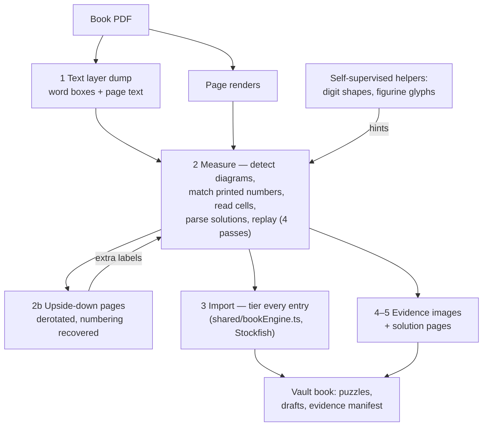

# Book import pipeline

*English · [한국어](book-import-pipeline.ko.md)*

Turns a scanned tactics-book PDF into a vault puzzle book: positions,
verified solutions, per-puzzle evidence images, and honest fidelity
tiers. Everything runs locally; only the resulting vault files matter.

## Two ways in, one set of code

**In the app** is the normal way: open a puzzle book, import its PDF, and
the browser does the whole thing — renders each page, finds the diagrams,
reads them with CellNet across a pool of workers as wide as the machine,
reads the page's text layer, pairs numbers to diagrams, works out how the
book writes its answers, saves what replays as numbered puzzles, asks the
engine about the boards whose printed answer would not replay, and
uploads the pages all of it points at. The user picks a file; there is
nothing to configure, and nothing about the book is written down
anywhere.

**Offline** is the backup and the laboratory. The stages below run the
same shared code (`shared/bookImport.ts`, `shared/bookConfigSearch.ts`,
`shared/bookSolve.ts`, `shared/bookGlyphs.ts`, `shared/bookRepair.ts`,
`shared/bookEngine.ts`) over pre-rendered pages, which is what makes it
possible to measure a change against a whole book in a minute instead of
re-scanning in a browser. The passes it once carried alone — glyph hints,
solution-constrained board repair, and the engine tiers — are all in the
app now. What stays offline-only is the repair search's third cell (the
app stops at two edits, because its search runs while somebody watches an
import finish) and the things that make measurement fast rather than
better: the read cache, the engine cache, and `--jobs` sharding.

Beware what those two make of the same book: a warm offline measure reads
no pixels at all (`read cache: N boards`) and finishes in seconds, while
the app reads every board every time. Cold and single-process, the two
are within about 15% of each other per board — 1.01 s offline against
1.17 s in the browser, of which ~948 ms is CellNet either way.

The per-book config files under `scripts/ml/books/` belong to the offline
side only. The app states none of it: number style and ceiling are read
off the book's own numbering, the label window is fitted from its layout,
the notation is searched, and the answer pages are wherever the winning
anchor fires.

## The core idea: the book proves itself

A puzzle is only imported as a **book solution** when the whole chain
agrees: the diagram was read into a position, the printed solution was
parsed into moves, and replaying those moves on that position is legal
(with any claimed mate actually mate, and the position passing a
piece-count reachability gate). One success validates all three inputs
at once. Everything that fails the chain degrades gracefully into
engine-backed tiers or drafts — nothing is silently dropped, and that is
now true of an import run in the app, not only of the offline pipeline.

Every puzzle carries its evidence whatever tier it landed in: the page it
was printed on, its rect on that page, and the page its answer is on.

## Stages (`scripts/ml/`)



1. **Text layer dump** — `extract_pdf_words.py <book.pdf> <out.json>`:
   pymupdf word boxes + page text.
2. **Measure** — `autoimport-measure.ts <pages_dir> --book <cfg>`:
   per page, detect diagrams, match each to its printed number, read the
   64 cells with CellNet, parse the solutions chapter, replay. Passes:
   - pass 1: plain replay;
   - pass 2: the learned **figurine dialect** (garbage OCR prefixes →
     pieces, learned from this book's own validated entries);
   - pass 3: `--glyph-hints` (image-read figurine glyphs, see below);
   - pass 4: `--repair` — solution-constrained board repair: retry the
     line under the classifier's runner-up labels (1 cell anywhere, then
     2 and 3 cells among the least-confident, test-time-augmentation
     votes prioritised); accept only a UNIQUE working position; ties export
     as `repairCandidates`.
   `--jobs N` shards page reads and the repair search across N child
   processes. Reads cache to `<slug>-reads.json` (with rects and sides);
   `--emit <dir>` dumps board/page grays for evidence images.
2b. **Upside-down pages** — `derotate.ts <pages_dir> --book <cfg>`: finds
   pages that hold diagrams but offer no numbers and no ordinary English,
   rotates their renders back, and recovers their numbering from the gap
   it leaves — only where the gap is exactly as wide as the run has
   diagrams. Emits an `--extra-labels` file for a second measure pass.
3. **Import** — `autoimport-import.ts <emit_dir> --book <cfg> --jobs N`:
   tiers every entry. Validated → book-parsed; else Stockfish solves the
   read position — decisive + overlapping the squares the book's entry
   mentions → engine-corroborated; decisive alone → engine-only; legal +
   known side → engine-unverified; rest → drafts. That decision is
   `shared/bookEngine.ts`, which takes the engine as a parameter, so the
   app runs the identical rule with its own Stockfish worker and the
   tests run it against a fake. Repair ties are settled here: exactly one
   candidate whose engine line is decisive and square-corroborated
   imports as a book solution. Engine results cache to
   `<report>-engine-cache.json`, so re-imports are cheap. Writes the
   vault book (puzzles/drafts/book.json + evidence manifest).
4. **Evidence images** — `evidence_jpegs.py` converts emitted grays.
5. **Solution pages** — `enrich_solution_pages.py <cfg>` stamps
   every puzzle/draft with the solutions-chapter page covering its
   number (rendered separately into `diagrams/`), so the trainer can
   peek at the printed answer. The app does the same for itself, from
   the same rule in `answerPageIndex()` (`shared/bookImport.ts`): anchor
   a number where the answers pages print it, and fall back to the page
   whose run of numbers covers it. It renders and uploads those pages
   too — an answers chapter holds no diagrams, so nothing else in a scan
   would ever have kept them.

Self-supervised text helpers (both take `--book`):
- `digit_labels.py` — learns the book's digit shapes from text-layer
  word boxes of already-matched numbers, then reads the printed number
  above any diagram the text layer lost (`--extra-labels` feeds the
  recoveries back into measure).
- `figurine_glyphs.py` — aligns validated entries' printed tokens with
  known SAN to label figurine glyph crops, then reads every garbage
  prefix and emits prefix→piece hints for pass 3.

## Per-book configs (`scripts/ml/books/*.json`)

Every book-specific fact is data: page ranges, artifact paths, number
style (`bare` digits vs `123)`), solutions anchor (`N - 1.` / `N) Name`
/ `N. Name`), move markers (dotted vs dotless), where the side to move
is printed (`chapter` header, per-puzzle `label` "White to play", or a
bare `letter` W/B under the number), label-matching window, and
`cropTrim` for books that print coordinates in a gutter outside the
frame. A config states only what its book needed: the 1001 book's
overrides one default (`moveMarkers`) and leaves the rest —
`numberStyle`, the label window — to the script's own.

Books that put an answers section after **every chapter** instead of one
at the back list their spans in `solutionRanges` (`[[28,33],[45,48],…]`),
which replaces the "everything after `solutionsAfterPage`" rule — that
rule would swallow the puzzle pages sitting between the sections. Add `pdf` (the file's NAME, not its path — point `CHESS_BOOK_PDFS` at
wherever your copies live; name the file for the book's `slug`, so a
committed config never carries whatever your copy happened to be called)
and `coverPage` so `render_book_pages.py` can find the source; the configs written before that script still lack both
fields, and its runbook step cannot run for those books until they gain
them. Configs are committed; nobody's disk layout should be.

## Runbook (per book)

Starting a book nobody has read yet is circular, and the order is the
part that is easy to get wrong: the stages will not run without a
config, and `search-config.ts` — the thing that works the notation out
from the book's own printed solutions — scores its candidates against
boards, which only exist once a stage has read them. So:

1. write a config with the identity fields only (`slug`, `title`,
   `pages`, `solutionsAfterPage`, `maxNumber`, and the `text`/`cache`/
   `report` paths), guessing the notation;
2. run the measure once to fill the read cache;
3. run `search-config.ts --book <cfg>` and copy the winner in;
4. measure again — it reads no pixels this time — and check how many
   solutions validated.

[Importing a book from the shell](book-import-offline.md) walks that
through with the commands. What follows assumes the config is right.

```
# once: extract text, write the config, render pages
python scripts/ml/extract_pdf_words.py book.pdf data/ml/<slug>-text.json
python scripts/ml/harvest_pdfs.py book.pdf data/ml/<slug>-pages   # page-NNN.gray
npx tsx scripts/ml/autoimport-measure.ts <renders> --book cfg.json --emit <emit> --repair --jobs 6
npx tsx scripts/ml/derotate.ts <renders> --book cfg.json          # if any page is upside down
npx tsx scripts/ml/autoimport-measure.ts <renders> --book cfg.json --emit <emit> --repair --jobs 6   --extra-labels data/ml/<slug>-extra-labels.json
npx tsx scripts/ml/autoimport-import.ts  <emit>    --book cfg.json --jobs 6
python scripts/ml/evidence_jpegs.py
python scripts/ml/render_book_pages.py cfg.json                   # cover + answers
python scripts/ml/enrich_solution_pages.py cfg.json
```

Caveats: a re-import wipes `diagrams/` — cover and solution-page jpgs
must be restored after `evidence_jpegs.py`, which is what
`render_book_pages.py` is for. Progress survives because puzzle ids are
`n<number>`. To re-read boards (e.g. after a model update) delete
`<slug>-reads.json` first; otherwise reads come from cache and only
validation reruns.

## Results so far (bootstrap phase)

These are the importer's benchmark, measured against scans of books
supplied by whoever ran it. The books are commercial and none of them —
no page, no diagram, no puzzle — is in this repository or ships with the
app; what a book yields stays in that person's vault.

Each row is the last run recorded for that book, not a number today's
pipeline reproduces: the 1001 config's own note records that its read
cache carries 980 rects fresh detection no longer finds, and warns
against re-importing on these figures. Where `ml-history.md` tells the
same story with slightly different numbers (Woodpecker at 1,042 imported
and 82 drafts), that is the earlier run of the same re-measure, kept as
history.

| Book | Imported | Book solutions | Drafts |
| --- | --- | --- | --- |
| 1001 Chess Exercises for Beginners | 970 / 1001 | 739 | 10 |
| The Complete Chess Workout | 1,145 / 1,200 | 530 | 0 |
| The Woodpecker Method | 1,043 / 1,128 | 619 | 81 |
| The Ultimate Chess Puzzle Book | 689 / 1001 | 204 | 166 |
| 5334 Problems, Combinations and Games | 4,878 / 5,334 | 4,878 | — |

For a like-for-like figure from the app rather than the pipeline: the
1001 book imported in the browser, on a 12-core machine, reads its 126
pages and 1,033 diagrams in 314 s, then spends 8 s asking the engine
about the 276 boards whose printed answers would not replay. It comes
out as 957 puzzles — 688 book-parsed, 108 engine-corroborated, 108
engine-only, 53 engine-unverified — and 76 drafts. Fresh detection, no
caches, which is why the book-parsed count sits below the row above:
that row's read cache holds rects today's detection no longer finds.

That engine phase cost 137 s until it was rebuilt — one four-threaded
engine searching a fixed half second a board, on a machine with eleven
idle cores. It is now a pool of single-threaded engines stopping at
depth 16, which is 16.7x on the same book and the same machine, with the
scan either side of it unchanged (313.6 s on the run that produced the
numbers above). What it costs is tier, not puzzles: the engine settled
269 of the 276 against 270 before, and thirteen boards that used to be
claimed as corroborated or engine-only now import badged unverified.

The Ultimate Chess Puzzle Book is the weakest of the scans. Ten of its
pages were scanned upside down; `derotate.ts` turns those back over and
recovers their numbering from the gap they leave (855 of its 1001
diagrams now find a number, up from 778). What still holds it back is its
answers, which are prose with the moves embedded in sentences — the
mainline parser handles that badly, and it is where the remaining room
is.

**5334 did not use this pipeline at all** — see below.

## Two importers that skip the scan

Neither of these is a per-book script: like everything else here, the
book's own facts live in `scripts/ml/books/*.json` and the code never
knows which book it is reading.

### `import-diagram-text.ts` — diagrams that are already text

    npx tsx scripts/ml/import-diagram-text.ts --book scripts/ml/books/<slug>.json

For books typeset in LaTeX with a diagram font, where every position is
already in the text as one character per square (two glyphs per piece, one
for light squares and one for dark) and every solution is plain algebraic.
Nothing is recognised; it is read.
Every entry is still replayed with chessops before it is imported, which
is what catches a misread entry and what locates the printed position
inside the 600 miniature games, whose answer is the whole game score.

It writes no drafts: a draft exists so a human can re-read a board the
importer could not, and here the boards are exact — it is the remaining
SOLUTIONS that fail to parse. Those numbers are printed by the run with
the reason, and a better parser picks them up in place, since ids are
`n<number>`.

The lesson generalises: **check the text layer for diagram glyphs before
reaching for CellNet.** It costs one `pdftotext` and can turn a week of
model work into an afternoon.

### `import-annotated-games.ts` — a book of annotated games as a study

    python scripts/ml/extract_pdf_lines.py "<book>.pdf" data/ml/<slug>-lines.json
    npx tsx scripts/ml/import-annotated-games.ts --book scripts/ml/books/<slug>.json

Writes one study chapter per game, each move carrying the book's note on
it. Moves are told from commentary by layout, not by font, and no token is
ever read: every legal move is scored against the scanned wreckage and the
whole game is searched depth-first for the reading under which every
printed move still resolves. A game that will not replay end to end is
reported, not written.

The scan's own confusions — which characters it uses for which rank, which
files it mixes up, which squares it collapses into one glyph — are in the
book's config, because they belong to that scan and to no other.

(Latest round: re-measured with the fine-tuned CellNet and the 3-cell
repair search. Progress survives a re-import because puzzle ids are
`n<number>`, so the vault can be updated in place as the pipeline
improves.)

The plan of record: when bootstrapping ends, every book is re-imported
from scratch with the then-current model and pipeline.
