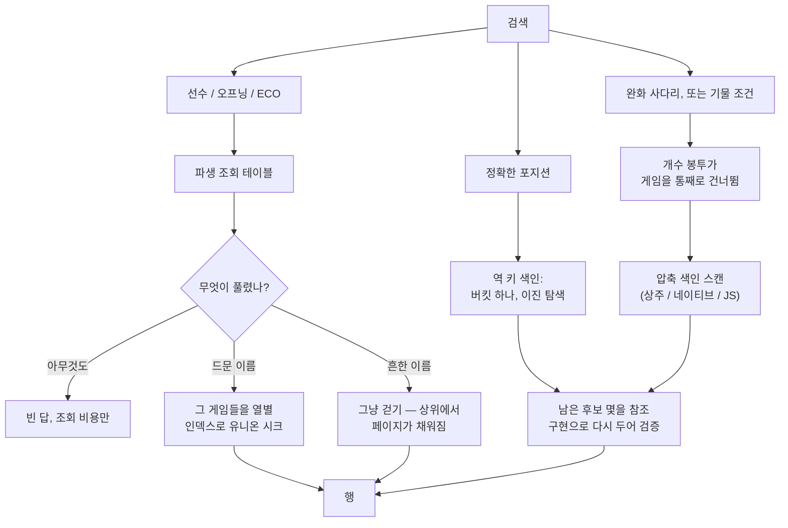

# 미리 준비하는 데이터베이스

*[English](databases.md) · 한국어*

앱의 기능 두 가지는 보관함과 함께 자라는 것이 아니라 **한 번 만들어 두는**
데이터베이스를 읽습니다:

| 파일 | 무엇이 읽는가 | 크기 | 만드는 주체 |
| --- | --- | --- | --- |
| `data/puzzles.sqlite` | 퍼즐 트레이너 | 약 2.6 GB | 앱의 퍼즐 페이지 |
| `data/refgames/*.sqlite` | 게임 페이지의 데이터베이스 브라우저, 로컬 탐색기, 레퍼토리 트레이너, 오프닝 맵 | 포지션 색인 포함 Elite 한 달치당 약 600 MB | 앱의 데이터베이스 페이지(또는 `npm run build:refgames`). 데스크톱 설치 프로그램은 25 MB 시작용 세트를 심어 줍니다 |

그 밖의 모든 것 — 북, 스터디, 노트, 가져온 퍼즐 책 — 은 앱 안에서
만들어집니다. `data/mygames.sqlite`는 그마저도 아닙니다. 탐색기의 내 게임
색인이 보관함의 PGN 파일에서 스스로 만들어지고 스스로 따라가므로, 사용자가
할 일이 아예 없습니다.

## 내 게임 색인

스스로 따라가는 그 색인을 조금 더 자세히 — "내 게임을 참고 데이터베이스에
비추어 보면"이라는 모든 질문의 나머지 반쪽입니다:

- **무엇을 담는가.** `vault/games` 아래의 모든 PGN: 모음과, 캐시된 아카이브
  달 전부. 질문이 올 때마다 가벼운 동기화가 먼저 돌고(2초에 한 번으로
  제한), 파일의 변경을 stat으로 알아채 바뀐 파일만 다시 색인합니다 — 아카이브
  브라우저가 달을 캐시하는 순간 새 게임이 집계에 들어오고, 만들기 단계는
  없습니다. 큰 보관함의 첫 동기화는 잠깐만 요청 안에서 색인하고 나머지를
  백그라운드에서 끝내며, 그동안의 조회는 이미 들어온 것으로 답합니다.
- **무엇을 아는가.** 각 게임이 누구의 것인지(아카이브 경로, `VaultSide`
  헤더, 프로필이 정합니다), 스피드, 날짜, 모음에 보관된 게임인지 — 그리고
  **60수(플라이)까지의** 모든 포지션. 참고 데이터베이스의 두 배 깊이인데,
  "내가 여기 와 봤나"는 25수째에도 물을 가치가 있지만 "누가 와 봤나"는
  그렇지 않기 때문입니다.
- **한 게임은 한 번만 셉니다.** 게임을 보관하면 모음으로 복사되지만 캐시된
  달에도 그대로 남습니다. 색인은 게임 자신의 URL로 중복을 가려 두고, 살아남는
  쪽은 주석을 달 수 있는 사본입니다.
- **누가 읽는가.** 탐색기의 내 게임 소스(내 수와 내 결과, 최근 게임이 먼저),
  오프닝 맵의 필드 통계, 늘리기 시트의 이탈 목록, 그리고
  `/api/mygames/compare`.
- **파생 데이터입니다.** `data/mygames.sqlite`를 지워도 재검색 한 번이
  전부입니다 — 진실은 PGN 파일입니다.

이 선택들 뒤의 측정값까지 담은 설계 기록은 `server/myGames.ts`의 머리말
주석입니다.

**퍼즐 데이터베이스는 이제 예외가 아닙니다.** 데이터베이스 없이 퍼즐을 열면
앱이 만들어 주겠다고 제안합니다. 서버가 CC0 Lichess 덤프를 내려받아 자식
프로세스에서 데이터베이스를 만들고, 진행 상황을 보고하면 페이지가 그것을
막대로 그립니다. 여기서 측정한 값: 내려받기 304 MB, 그 뒤 퍼즐 6,100,960개를
쓰고 색인하는 데 115초. 페이지를 떠나도 작업은 계속되고, 트레이너는 재시작
없이 새 파일을 집어 듭니다.

## 직접 손봐야 할 때

거의 없습니다. 배포가 색인과 카운트 테이블, 수별 합계를 최신으로 유지하고
(`scripts/deploy.sh`가 `tune-dbs.ts`를 돌립니다), 파일 자체는 저절로 바뀌지
않습니다.

다시 만들 이유는 정확히 둘뿐입니다:

**더 새로운 퍼즐 모음.** Lichess가 주기적으로 갱신된 덤프를 냅니다.
`npm run build:puzzles`가 그것을 받아 옵니다. `data/`에 덤프가 없으면
내려받고, 데이터베이스는 임시 파일에 쓴 뒤 이름을 바꾸므로 돌아가는 서버는
끝날 때까지 기존 것을 계속 서빙합니다. 스크립트가 직접 내려받은 덤프는
끝나고 지우고, 사용자가 두었던 덤프는 건드리지 않습니다.

아직 이걸 위한 버튼은 없습니다. 앱의 만들기 제안은 데이터베이스가 아예 없을
때만 나타나므로, 잘 돌아가는 것을 바꾸려면 여전히 명령을 쓰거나 먼저 파일을
지워야 합니다. 일부러 둔 제한이 아니라, 아직 없는 UI입니다.

시도 기록은 보관함에 있고 퍼즐 id로 키를 잡으므로, 다시 만들어도
살아남습니다.

**참고 게임 늘리기.** 참고 게임 데이터베이스는 하나가 아닙니다.
`data/refgames/<이름>.sqlite`가 각각 독립된 데이터베이스이고, 게임 페이지의
데이터베이스 브라우저에서 목록으로 보고 바꿔 가며 검색합니다. 데이터베이스
페이지에서 PGN 모음을 올리고(여기의 모든 데이터베이스 빌드가 쓰는
`vault/sources/` 업로드입니다), 골라서 이름 붙여 색인하고, 필요 없어진 것을 —
만든 데이터베이스든 그것을 만든 업로드든 — 지웁니다. 아래의 동작은 모두
데이터베이스 자기 행의 것이고, 행은 두 모습을 가집니다: 넓은 화면에서는
여기 이름 붙인 아이콘들이고, 폰에서는 같은 동작들이 행의 **⋯** 메뉴에
글로 적혀 있습니다 — 이름과 아이콘 넷이 폰 너비에 함께 들어가지 않기
때문입니다. 데이터베이스는 **자기
행에서 자랍니다**: 행의 +가 창 하나를 열고, 그 안에 올려 둔 모음들이 각자의
체크와 함께(아직 서버에 없는 파일을 위한 올리기 버튼도 함께) 나열됩니다 —
게임 추가를 누르면 데이터베이스에 아직 없는 게임만 색인되고(선수·결과·날짜·
기보가 같으면 같은 게임입니다), 포지션 색인은 처음부터 다시 만드는 대신
멈췄던 자리에서 이어집니다. 같은 파일을 두 번 먹여도 아무것도 늘지 않습니다.
추가가 게임을 넣고 색인하기 전에 끊기면 데이터베이스는 그대로 서빙되면서
관리자에 **색인이 뒤처짐**으로 표시되고, 아래의 최적화가 고칩니다. 만들기
바에서 이미 있는 이름으로 만들면 손대기 전에 같은 교체/추가 질문을 먼저
묻습니다.

관리자의 데이터베이스 행마다 **최적화**도 있습니다: 완전히 같은 게임을
제거하고(추가의 중복 제거가 생기기 전에 만든 데이터베이스, 또는 겹치는
모음으로 만든 것을 위해), 파생 테이블을 전부 다시 만들고, 파일을 압축합니다.
진짜 삭제입니다 — SQLite에는 표시해 두었다가 나중에 쓸어 내는 방식이 필요
없습니다 — 그리고 마지막 VACUUM이 공간을 돌려줍니다.

같은 색인기를 터미널에서도 돌립니다:

```
npm run build:refgames                    # vault/sources/의 모든 PGN
npm run build:refgames -- elite-2025-11.pgn --name elite
npm run build:refgames -- dec.pgn --name elite --append
```

만들어진 데이터베이스가 무엇에 어떻게 답하는가:

- 게임 페이지의 **데이터베이스 브라우저**는 게임 전체를 검색합니다 —
  선수와 오프닝은 작은 파생 조회 테이블을 통해 찾아 들어가고, 페이지는 id로
  이어 받으며, 걸러진 개수는 수백만 행을 끝까지 세는 대신 "10,000+"에서
  멈춥니다.
- 같은 브라우저가 **포지션이나 기물 구성으로도 사냥합니다**. 검색창 옆의
  스캔 검색 토글이 컨트롤을 펼칩니다. 포지션 사냥은 FEN을 — 붙여넣거나
  보드에서 직접 차려서 — 받고, 얼마나 가깝게 맞출지를 고릅니다: 정확히
  같은 포지션, 같은 폰, 같은 폰 파일, 같은 기물 구성 — 고정된 완화
  사다리입니다(왜 쿼리 언어가 아니라 사다리인지는 `docs/deferred.md`에
  기록되어 있습니다). 기물 사냥은 엔드게임 상황을 고릅니다 — 프리셋은
  데이터입니다, `web/src/games/endgames.json`, 폰 엔딩부터 "퀸 하나
  앞섬"까지 — 아니면 기물별·진영별 개수를 직접 짜는 커스텀 편집기를 쓰고,
  그 구성이 얼마나 유지되어야 하는지(어느 순간이든, 4수 이상, 8수 이상)를
  더합니다. 찾은 게임은 스캔이 도는 동안 진행 상황과 함께 실시간으로
  도착하고, 위의 필터 줄은 텍스트 검색을 좁히는 것과 똑같이 사냥을
  좁히며, 텍스트 검색을 입력하면 사냥에서 나갑니다. 탐색기의 **이
  포지션을 데이터베이스 브라우저에서 찾기** 버튼은 지금 포지션을 그대로
  넘겨서, 미리 채워진 채 이미 실행 중인 상태로 도착합니다.
  합계로 답합니다 — 게임의 낮은 쪽 레이팅을 200점 단위로 묶은 **레벨**
  구간으로 잘라서도, 전체 답만큼 빠르게. "내 수준의 사람들은 여기서 뭘
  두나"가 그렇게 읽힙니다.
- 그 30수를 지나면 탐색기가 **모든 게임에서 이 포지션 찾기**를 제안합니다:
  데이터베이스 전체의 기보를 깊이 제한 없이 훑는 스트리밍 검색으로, 진행
  상황과 찾은 게임이 실시간으로 도착하고, 참고 필터가 수 테이블에서처럼
  똑같이 적용됩니다. 네이티브 파이프라인 바이너리가 있으면(`native/`
  참고) 검색이 충분히 빨라서, 탐색기가 버튼을 내미는 대신 스스로
  실행합니다.
- `/api/mygames/compare`는 **내 게임**을 데이터베이스에 비추어 봅니다:
  그 데이터베이스의 선수들이 두는 수 가운데 내 수가 드문 포지션마다(레벨
  구간을 주면 내 수준에서), 최근 게임 전체에 걸쳐 집계해서. 이 리포트는
  오프닝 맵이 담습니다 — **내 수를 데이터베이스와 비교** — 표시된 어느
  줄이든 결정 지점에서 보드에 열리고, 거기서 탐색기가 질문을 이어받습니다.

단일 파일 시절의 `data/refgames.sqlite`를 아직 갖고 있는 기계는 서버가
다음에 켜질 때 옮겨집니다. 파일이 디렉터리 안으로 옮겨지면서 이름이 바뀌고,
meta에 출처가 하나 기록되어 있으면 그 출처의 이름을 받습니다.

## 참고 게임이 셸 없이도 되기까지

모든 사용자 동작은 앱 안에서 가능해야 한다는 것이 계속 지키는 규칙입니다. 이
문서는 그동안 이 두 데이터베이스가 충분히 따져 보고 둔 예외라고 주장했습니다
— 큰 공개 아카이브, 몇 분짜리 CPU 작업, 엔진 바이너리 설치처럼 서버를 세우는
과정의 일부라고요.

그 논리는 서버에서만 성립했습니다. 데스크톱 앱에는 저장소도, npm도, 셸도
없고, Windows와 macOS에는 `zstd`조차 없습니다. 실제로 이 앱을 설치해서 쓰는
사람들에게 "스크립트를 돌리세요"는 규칙의 예외가 아니라 퍼즐 트레이너가
없다는 뜻이었습니다. 그래서 퍼즐 빌드가 먼저 서버 쪽 작업이 되어, 그것이
필요한 페이지가 직접 제안하게 됐습니다.

`refgames.sqlite`가 그 뒤를 따랐습니다. 입력의 성격이 다르다는 것 — 공개
덤프 하나가 아니라 각자 갖고 있는 PGN 모음이라는 것 — 이 해법의 모양을
정했습니다. 모음 업로드는 이미 됐으므로(여기의 모든 데이터베이스 빌드가 쓰는
방식입니다), 만들기는 파일을 넣는 두 번째 방법을 만드는 대신 바로 그 업로드를
색인합니다.

데스크톱 설치 프로그램은 빈 시작을 한 번 더 덜어 줍니다. 릴리스 때
`build-bundled-refgames.ts`가 만드는 시작용 세트 — Lichess Elite 한 달치에서
ECO 코드마다 가장 강한 판들, 약 3.9만 판에 25 MB — 를 첫 실행 때
`data/refgames/`에 심습니다. 그 뒤로는 옆에 몇 개가 더 만들어지든 그중
평범한 데이터베이스 하나일 뿐이고, 지우는 방식도 다른 것과 같습니다. 서버
설치에는 심어 주지 않습니다. 릴리스 산출물이 아니라 커밋을 받기 때문입니다.

## 검색이 답하는 구조

위 표면들 뒤의 구조 — 각 질문이 무엇을 읽는지, 그리고 왜 어느 것도
"그렇다"고 말하려고 천만 행을 걷지 않는지. 바이트 배치는 여기 이름을 든
파일들의 스펙 주석으로 살아 있고, 각각 골든 픽스처로 Rust 쌍둥이에
고정되어 있습니다. 이 절은 그 지도입니다.



**텍스트 검색은 큰 테이블을 건드리기 전에 작은 테이블에서 풀립니다.**
서로 다른 선수와 오프닝의 수는 게임이 몇 개든 수만 단위라서, 질의는 먼저
그 파생 조회 테이블을 상대로 돌고, 무엇이 풀리는지가 계획을 정합니다.
아무것도 풀리지 않으면 답은 빈 것 — 조회 테이블 LIKE 한 번의 비용으로,
없는 걸 알아내려고 전체를 걷던 옛 최악 사례 대신. 드문 이름은(풀린 행들
자신의 게임 수가 말해 줍니다) **유니온 시크**됩니다: 그 몇 게임을 열별
인덱스로 찾아 들어가지, 훑어서 찾지 않습니다. 흔한 이름은 그냥 걷습니다 —
상위 id 근처에서 페이지를 채우고 멈추니, 원래 걷기가 맞는 경우입니다.
페이지는 OFFSET이 아니라 키셋(마지막으로 본 id)으로 이어 받고, 걸러진
개수는 자릿수를 끝까지 세는 대신 10,000+에서 포기합니다.

**모든 게임은 압축 스캔 색인을 지니고 있습니다**(`shared/scanPack.ts`):
게임당 블롭 하나에 — 포지션마다 Zobrist 키의 하위 32비트와 폰 구조 해시,
플라이마다 그 수가 기물 구성에 무엇을 했는지, 그리고 12바이트 **개수
봉투** — 게임의 기물 수 극값들이라, 목표의 개수가 결코 겹칠 수 없는
게임을 상수 시간에 통째로 기각하게 해 줍니다. 블롭은 색인할 때 한 번
쓰이므로, 스캔은 SAN을 파싱해 다시 두는 대신 바이트를 읽습니다.

**정확한 포지션 검색은 스캔이 아니라 조회입니다.** 역 키 색인
(`shared/keyIndex.ts`)은 전적으로 팩에서 파생됩니다 — 모든 포지션의
32비트 키를 버킷별 정렬된 런으로 뒤집은 것 — 그래서 정확 사냥은 버킷
하나를 읽어 이진 탐색합니다: 데스크톱 데이터베이스들이 서치 부스터라
부르는 그것입니다. 키 동등성에만 답하고, 32비트 키는 답이 아니라 사전
필터라서, 후보가 된 몇 게임은 반환 전에 참조 구현으로 다시 두어
검증됩니다. 색인은 팩이 다시 쓰일 때마다 통째로 다시 만들어집니다.

**완화 사다리와 기물 사냥은 팩을 스캔합니다.** 어떤 역색인도 미리 답할
수 없기 때문입니다. 사다리(`shared/scanMatch.ts`, Scid의 것)는 무엇이
어디 서 있는지를 단계별로 풉니다 — 정확한 키, 제자리의 폰, 파일만 맞는
폰, 기물 구성만 — 하지만 차례는 절대 풀지 않습니다. 기물 검색에는 목표
포지션 자체가 없습니다: 기물별 개수 범위, 백 빼기 흑 차이 범위, 그
상황이 유지되어야 하는 플라이 수뿐. 봉투가 게임을 통째로 건너뛰고, 팩이
나머지를 거르고, 살아남은 모든 후보는 정확 경로와 같은 방식으로
정해집니다: 그 한 게임을 다시 두어 검증. 팩만으로 답하는 것은 없습니다.

**빠른 검색은 다른 알고리즘이 아니라 상주입니다.** 데이터베이스를 옵트인
하면 — 토글은 관리자의 그 데이터베이스 행에 있습니다 — 그 팩들이 그것을
소유하는 워커 스레드 하나에 실립니다
(`server/scanWorker.ts`) — 데이터베이스당 워커 하나, 요청은 그리로 줄을
서고, 30분 놀면 내려갑니다. 안에서는 기계의 코어 수가 정하는(요청량이
아니라) 고정된 샤드 스레드들이 적재, 스캔, 제자리 검증을 나눕니다. 상주
없이는 같은 사냥이 네이티브 바이너리로, 그것도 없으면 순수 자바스크립트로
흘러갑니다 — 느려질 뿐, 없어지지는 않습니다.

## 규모와 하드웨어

빌드·색인·검색이 실제 세 가지 크기에서 무엇을 요구하는지 — 클럽
모음, Lichess Elite 한 달치, 그리고 Mega Database급인 Lumbra's
Gigabase OTB. 전부 2026-08-28에 한 기계(Ryzen 5 7500F, 6코어, 32 GB,
NVMe)에서 현재 파이프라인으로 측정했다: 색인 패스는 포지션 색인,
카운트 봉투를 포함한 압축 스캔 색인, 역키 색인을 한 번에 쓴다. 직접
측정하지 않은 값은 *추정*으로 표시한다.

| | 3,436 게임 | 280,059 게임 | 10,355,488 게임 |
| --- | --- | --- | --- |
| 색인 패스, 네이티브 바이너리 | 0.55초 | 64초 | 55분 |
| 색인 패스, JavaScript | 2.2초 | 178초 | ~110분 *추정* |
| PGN에서 전체 빌드, 네이티브 | ~1초 *추정* | ~2분 *추정* | 빌드 48분 + 색인 패스 |
| 데이터베이스 파일, 색인 전부 포함 | 10 MB | ~1.0 GB | 32 GB |
| 색인 패스 중 RAM | 무시할 만큼 | ~0.3 GB | ~7 GB |
| 빠른 검색 상주 크기 | 1.7 MB | ~125 MB *추정* | 4.7 GB, 로드 16초 |

검색 속도는 1,000만 행에서 측정한 값이고, 작은 데이터베이스는 대략
선형으로 내려간다:

- **정확 포지션, 깊이 무관, 필터 유무 무관: 1–6 ms.** 역키 색인이
  조회로 답한다 — 옵트인도, 상주도, 질의 시점의 추가 RAM도 필요
  없다.
- **완화 단계와 기물 구성 검색: 0.1–0.8초**, 빠른 검색이 켜져 있을
  때(상주 스캔). 꺼져 있으면 같은 검색이 네이티브 바이너리로 ~30초,
  순수 JavaScript로 몇 분에 흐른다 — 느릴 뿐, 안 되는 일은 없다.
- **텍스트 검색: 28–110 ms.** 아무것도 안 걸리는 경우와 희귀한
  선수까지, 조회 테이블과 union-seek을 통해서.

기계 크기를 잡는 어림값:

- **색인**은 키를 뒤집는 동안 포지션당 약 8바이트 — 게임당 대략
  0.7 KB — 를 잠시 쥔다. 2 GB 서버는 ~200만 게임까지 무리 없이
  색인하고, Gigabase급 자료는 ~8 GB 여유를 원한다. 나머지는 전부
  스트리밍이다.
- **빠른 검색**은 팩을 메모리에 쥔다: 옵트인이 유지되는 동안 게임당
  약 0.5 KB(30분 유휴 시 내려간다). 정확 검색에는 필요 없다 — RAM이
  있는 곳에서 데이터베이스별로 켜면 된다.
- **디스크**는 색인 전부 포함 게임당 약 3 KB — 원본 PGN의 대략
  4배다.
- **마운트된 데이터베이스의 재색인**은 WAL 아래에서 작업을 커밋하지만,
  끝의 저널 되접기는 서버의 핸들이 닫혀 있어야 한다. 패스가
  "database is locked"로 끝났다면 서버를 멈추고 다시 돌리면 된다 —
  데이터는 이미 들어가 있다.

## 관리자

관리는 **데이터베이스 페이지**의 것이고, 다른 곳에는 없습니다. 게임 페이지의
데이터베이스 브라우저와
탐색기에 각각 데이터베이스 아이콘이 있지만 둘 다 이곳으로 이동합니다. 한동안은
각자 창으로 관리자를 열었는데, 그러면 업로드와 삭제가 검색이나 보고 있던 포지션
바로 옆 한 번의 클릭 거리에 있게 됩니다. 관리는 찾아가는 장소이지, 하던 일 위에
덮는 층이 아닙니다.

페이지는 스크롤하지 않습니다. 패널 하나가 남은 높이를 차지하고, 그 안에:

- 데이터베이스와 PGN 모음 사이의 **세그먼트 선택기**, 각각 개수와 함께. 둘은 같은
  선반의 두 단계인데, 한꺼번에 보이면 두 열이 따로 자랍니다. 데이터베이스 18개에
  모음 24개일 때 페이지가 1202px까지 늘어나고 만들기 버튼이 1074px 아래에
  있었습니다. 한 번에 한 목록이면 높이는 한 목록만큼이고, 스스로 스크롤합니다.
- 보이는 목록을 좁히는 **검색**.
- **올리기** 아이콘. 창 하나가 통째로 큰 드롭 영역입니다.
- 모음을 처음 체크하면 나타나는 **만들기 바**. 개수를 스스로 말하고 패널 아래에
  붙어 있어 목록이 아무리 길어도 보입니다. 새 데이터베이스의 이름을 받는 창을
  엽니다.

올리기와 이름 짓기는 각자 해당하는 목록 아래에 상시로 놓인 가구였고, 그것이 다른
모든 것을 아래로 밀어냈습니다. 둘 다 순간의 일이므로 — 파일 선택기와 텍스트 필드 —
이제 창입니다.

체크는 걸러진 목록이 아니라 모든 모음에 대해 셉니다. 다섯 개를 체크한 상태에서
검색이 셋을 감췄다고 만들기가 둘이라고 말해서는 안 됩니다. 만들기를 시작하면 검색을
비우고 데이터베이스 쪽으로 넘어갑니다. 그러지 않으면 방금 만든 것이 그 재료를 고를
때 쓴 검색어 뒤에 숨습니다.

## 지우기

둘 다 먼저 묻습니다. `ConfirmDialog`로 — 데스크톱에서는 가운데 창, 폰에서는
아래에서 올라오는 시트입니다. 어느 쪽도 사본을 남기지 않습니다. 두 경로 어디에도
휴지통 디렉터리가 없으니, 그 질문이 유일하게 사이에 있는 것입니다. 각 질문은
무엇이 *영향받지 않는지*를 말해 줍니다. 사람들이 짐작으로 채우는 부분이기
때문입니다 — 데이터베이스를 지워도 그것을 만든 모음은 남고, 모음을 지워도 이미
만들어진 데이터베이스는 그대로입니다.

지워진 모음은 빌드 체크도 함께 잃습니다. 다음 만들기가 이제 없는 파일을 지목하지
못하게 하기 위해서입니다. 거절된 삭제는 둘 다 그대로 두고, 이유를 말합니다.

만들기가 도는 동안에는 서버가 모음 삭제를 아예 거절합니다(409). 색인기가 그
경로들을 받아 아직 읽고 있기 때문입니다. 앱도 같은 이유로 버튼을 비활성화하지만
판단은 서버가 합니다. 다른 클라이언트가 그렇게 해 주리라고 믿을 수는 없습니다.
