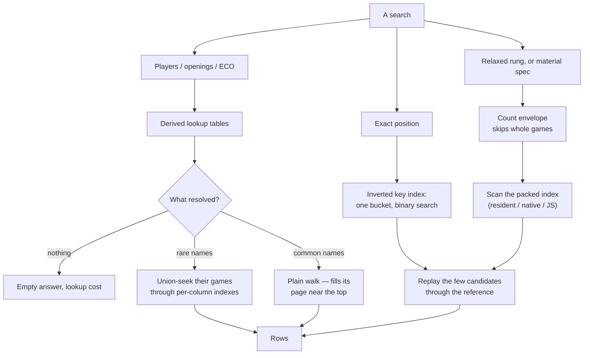

# The prepared databases

*English · [한국어](databases.ko.md)*

Two of the app's features read databases that are **built once**, rather
than growing with your vault the way everything else does:

| File | What reads it | Size | Built by |
| --- | --- | --- | --- |
| `data/puzzles.sqlite` | the puzzle trainer | ~2.6 GB | the app, on the Puzzles page |
| `data/refgames/*.sqlite` | the Databases browser on the Games page, the local explorer, the repertoire trainer and the opening map | ~1 GB per Elite month with every index in place (measured under "Scale and hardware" below) | the app, on the Databases page (or `npm run build:refgames`); the desktop installer seeds a 25 MB starter set |

Everything else — books, studies, notes, imported puzzle books — is made
inside the app, and `data/mygames.sqlite` is not even that: the explorer's
My games index builds and maintains itself from the vault's PGN files, so
there is no step for it at all.

## The My games index

The self-maintaining one, in more detail — it is the other half of every
"my games against the reference" question:

- **What it covers.** Every PGN under `vault/games`: the collection and
  every cached archive month. Each query first runs a cheap sync
  (throttled to once per two seconds) that notices changed files by
  stat and re-indexes those alone — new games count the moment the
  archive browser caches the month, with no build step. A first sync of
  a big vault indexes briefly inline and finishes in the background
  while lookups answer from what is already in.
- **What it knows.** Whose game each one is (the archive path, the
  `VaultSide` header and your profile decide), speed, dates, whether it
  is a kept collection game — and every position through **ply 60**,
  twice a reference database's depth, because "have I been here" stays
  worth asking at move 25 in a way "has anyone" does not.
- **One game, counted once.** Keeping a game copies it into the
  collection while the cached month still holds it; the index shadows
  the duplicate by the game's own URL, and the surviving copy is the
  annotatable one.
- **Who reads it.** The explorer's My games source (your moves with
  your results, recent games newest-first), the opening map's field
  statistics, the Grow sheet's deviations, and
  `/api/mygames/compare`.
- **It is derived data.** Deleting `data/mygames.sqlite` costs one
  re-scan and nothing else — the PGN files are the truth.

The full design record, including the measured costs behind these
choices, is the header comment of `server/myGames.ts`.

**The puzzle database is no longer one of the exceptions.** Open Puzzles
without one and the app offers to fetch it: the server downloads the CC0
Lichess dump and builds the database in a child process, reporting
progress the page draws as a bar. Measured here: 304 MB down, then 115 s
to write 6,100,960 puzzles and index them. The job survives leaving the
page, and the trainer picks the new file up with no restart.

## When you need to do anything

Almost never. A deploy keeps their indexes, count tables and per-move
sums current (`scripts/deploy.sh` runs `tune-dbs.ts`), and the files
themselves do not change on their own.

There are exactly two reasons to rebuild:

**A newer puzzle set.** Lichess publishes an updated dump periodically.
`npm run build:puzzles` takes it: the dump is downloaded if it is not
already in `data/`, and the database is written to a temp file and renamed,
so a running server keeps serving the old one until it finishes. A dump the
script downloaded itself is deleted afterwards; one you put there is left
alone.

There is no button for this yet — the app's build offer appears only when
there is no database at all, so replacing a working one still means the
command (or deleting the file first). That is a missing UI, not a
deliberate limit.

Attempt history lives in the vault and is keyed by puzzle id, so it
survives a rebuild.

**More reference games.** They are plural:
`data/refgames/<name>.sqlite`, each an independent database, listed and
switched in the games-page Databases browser. The Databases page uploads PGN files
(the same `vault/sources/` uploads), indexes any selection of them under a
name, and deletes either kind — the built database or the upload it was
built from. Every verb below belongs to a database's own row, and the
row has two shapes: on a wide screen the verbs are the icons named here,
and on a phone they are the same verbs written out in the row's **⋯**
menu, because a name and four icons will not both fit a phone's width.
A database **grows from its own row**: the + on it opens
one window that lists the uploaded PGN files with their own ticks
(and an Upload button, for games not on the server yet) — press Add
games and only the games the database does not already hold are indexed
(same players, result, date and movetext is the same game), with the
position index extending from where it left off instead of rebuilding.
Feeding the same file twice adds nothing. An append interrupted between
its insert and its index pass leaves the database served but marked
**index behind** in the manager; Optimise (below) heals it. Building
under an already-taken name from the build bar asks the same
Replace-or-Add-to question before touching anything.

Each database row in the manager also offers **Optimise**: remove
exact duplicate games (for databases built before the append dedup
existed, or from overlapping sources), re-derive every derived table,
and compact the file. Real deletions — SQLite wants no flag-and-sweep
model — with the space returned by the final vacuum.

The same indexer runs from a terminal:

```
npm run build:refgames                    # every PGN in vault/sources/
npm run build:refgames -- elite-2025-11.pgn --name elite
npm run build:refgames -- dec.pgn --name elite --append
```

What a built database answers, and from where:

- The **Databases browser** on the Games page searches whole games —
  players and openings seek through small derived lookup tables, pages
  seek by id, and a filtered count stops at "10,000+" rather than
  scanning millions of rows to finish the digit. The search box speaks
  a small qualifier language (`player:`, `opponent:`, `white:`/`black:`,
  `opening:`, `eco:`, `event:`, `result:`, `year:`, `elo:` — the box's own
  panel documents it), parsed once in `shared/searchQuery.ts` for the server
  and the in-page collection search alike; impossible combinations
  warn instead of silently finding nothing. An opening name matches the
  catalogue's positions as well as the source's own `Opening` text, so
  the names the box suggests find games on a database whose PGN carried
  none (the big dumps), the same way the explorer names them.
- The same browser **hunts by position, material or motif**. The
  scan-search toggle beside the search box unfolds the controls. A position hunt
  takes a FEN — pasted, or set up on a board — and how closely to
  match (`docs/deferred.md` records why this is a fixed ladder and not
  a query language). Concretely, per rung:
  - **Exact position** — this position to the square, side to move,
    castling and en passant included; transpositions count.
  - **Same pawns & material** — every pawn on its exact square and the
    same piece counts, only the pieces' squares free. A Carlsbad
    middlegame with R+B vs R+N finds the games fought with that exact
    skeleton and those exact forces — the "show me this middlegame in
    master play" search, seeded from a real position.
  - **Same pawn files & material** — the pawns may advance within
    their files, material still identical: the same structure a tempo
    or two further on.
  - **Same pawn structure** — the pawn skeleton alone; pieces and the
    side to move are both free. This is the rung a pawns-only sketch
    means: place just the pawns of 1.e4 c5 on the editor's board
    (kings optional — the hunt accepts a kingless sketch) and every
    game that ever passed through the Sicilian structure answers,
    whatever was on the board around it.
  - **Same material** — piece counts alone: every R+P-vs-R endgame,
    wherever the men stood.
  Every rung except *Same pawn structure* also keeps the target's side
  to move — those rungs relax *where* things stand, never whose turn
  it is; a structure is a fact about a phase, so that rung keeps
  neither. The rungs nest only up to a point: exact ⊂ pawns&material,
  and pawns&material ⊂ each of the other three — every one of them
  forgets one more thing — but files&material, material and structure
  fan out from there, none containing another. Loosening down the
  chain only adds games; switching between the three loose rungs can
  lose and gain games at once. A material hunt picks an endgame
  situation — the presets are data, `web/src/games/endgames.json`, from
  pawn endgames to "a queen up" — or a custom per-piece, per-side count
  editor, plus how long the material must hold (any moment, 4+ or 8+
  moves). A motif hunt picks a pattern rather than a position or a
  count — the two the ladder cannot express, and never a query
  language (`docs/deferred.md` records that line). **Isolated queen's
  pawn**: for a side, exactly one pawn on the d-file, none on the c-
  or e-file, and the opponent has no d-pawn, so a symmetrical
  d4-against-d5 pair is not one; whose it is (whichever side, White or
  Black) and how long it must hold, with four moves the default so a
  recapture's passing isolani does not count. **Opposite-side
  castling**: the two kings castled to different wings; the hit is the
  position after the second castle, so the found game opens with both
  kings just castled. The same list offers six named pawn structures —
  Carlsbad, French advance chain, King's Indian closed centre, Maróczy
  bind, Hedgehog, Stonewall — each a pawns-only sketch
  (`web/src/games/structures.json`, every pawn on its square) that
  runs the *Same pawn structure* rung, so the answer is exactly what
  drawing that sketch on the editor's board would find. The motifs are
  data too, `web/src/games/motifs.json`; through the API a motif holds
  for one ply unless the request says otherwise, as a material spec
  does. Hits stream in as the scan runs, with progress; the filter
  row above and the search box both narrow a hunt exactly as they
  narrow the text search — editing either re-runs an open hunt. The
  explorer's own **Find this position in the databases browser**
  button hands the current position across, prefilled and already
  running.
- The **explorer** answers any position in the first 30 plies from
  precomputed per-move sums — including sliced by the **Level** band
  (200-point buckets of the game's lower rating), so "what do players
  at my level play here" reads as fast as the corpus-wide answer. The
  eight games under its table are ranked at index time too, per
  position and Level band, for every position the sums put at 5,000
  games or more (`top_games`, beside the sums); a rarer position is
  joined live, in the database's query worker, off the server's own
  thread.
- Past those 30 plies, the explorer offers **Search every game for
  this position**: a streamed scan of the whole database's movetext,
  any depth, progress and hits arriving live, the reference filters
  applying to it exactly as to the move table. When the native
  pipeline binary is present (see `native/`) the scan is fast enough
  that the explorer runs it by itself instead of offering the button.
- `/api/mygames/compare` diffs **your own games** against a database:
  every position where your move is rare among what its players answer
  (at your level, when a band is given), aggregated across your recent
  games. The opening map carries the report — **Compare my moves with a
  database** — and each flagged line opens on the board at the decision
  point, where the explorer can take the question further.

A device still carrying the single-file era's `data/refgames.sqlite`
migrates on the server's next start: the file is renamed into the
directory, named after its source when the meta records one.

## How reference games stopped needing the shell

The standing rule is that every user action must be possible in the app.
This page used to argue that these two databases were a considered
exception — big public archives, minutes of CPU, part of standing a server
up like installing the engine binaries.

That argument only ever held for a server. The desktop app has no
repository, no npm and no shell, and on Windows and macOS no `zstd`
either, so for the people the app is actually installed by, "run the
script" was not an exception to the rule: it was the puzzle trainer being
unavailable. The puzzle build became a server-side job, offered by the
page that needs it.

`refgames.sqlite` followed, and its input being different in kind — not
one public dump, but whatever PGN files you happen to have — is
what dictated the shape of the fix: uploading PGN files already worked
(the pattern every database build here uses), so the build offer
indexes those same uploads rather than inventing a second way to get
files in.

The desktop installer softens the empty start besides: it carries a
starter set — the strongest games of every ECO code from one Lichess
Elite month, ~39 k games in 25 MB, built by `build-bundled-refgames.ts`
at release time — seeded into `data/refgames/` on first run, the same
way the bundled starter is. It is an ordinary database from then
on, one name among however many are built beside it, and deleting it
works like deleting any other. A server install gets no seed; it takes
the commit, not the release artefacts.

## How the search answers

The structure behind the surfaces above — what each kind of question
reads, and why none of them walks ten million rows to say so. The byte
layouts live as spec comments in the files named here, each pinned
against the Rust twin by golden fixtures; this section is the map.



**Text search resolves against small tables before touching big ones.**
Distinct players and openings number in the tens of thousands whatever
the game count, so the query runs against those derived lookup tables
first, and what resolves decides the plan. Nothing resolving means the
answer is empty for the cost of a lookup-table LIKE — the old
worst case, a full walk to discover no match. A rare name (the resolved
rows' own game counts say so) is **union-seeked**: its few games are
fetched through the per-column indexes rather than scanned for. A
common name keeps the plain walk, which fills its page near the top and
stops. Pages seek by keyset (last id seen), never OFFSET, and a
filtered count gives up at 10,000+ instead of finishing the digit.

**Every game carries a packed scan-index** (`shared/scanPack.ts`): one
blob per game holding, per position, the low 32 bits of its Zobrist
key and a pawn-structure hash; per ply, what the move did to the
material; and a twelve-byte **count envelope** — the game's material
extremes, letting a scan reject a whole game in constant time when the
target's counts could never overlap it. The blob is written once, at
index time, so a scan reads bytes instead of parsing SAN and replaying.

**Exact position search is a lookup, not a scan.** The inverted key
index (`shared/keyIndex.ts`) is derived entirely from the packs — every
position's 32-bit key, inverted into sorted per-bucket runs — so an
exact hunt reads one bucket and binary-searches it: what desktop
databases call a search booster. It answers only key equality; and a
32-bit key is a prefilter, not an answer, so the few candidate games
are replayed through the reference implementation before anything is
returned. The index is rebuilt whole whenever the packs are.

**The relaxed rungs and material hunts scan the packs**, because no
inversion can pre-answer them. The ladder (`shared/scanMatch.ts`,
Scid's) loosens where things stand — exact key, pawns on their squares,
pawns on their files, bare material — but never whose turn it is; the
material search has no target position at all, just per-piece count
ranges, white-minus-black difference ranges, and how many plies the
situation must hold. The envelope skips whole games, the pack gates
the rest, and every surviving candidate is settled the same way the
exact route settles: that one game replayed and verified. Nothing is
answered from the pack alone.

**A motif hunt is the one search the packs cannot gate.** The pack
carries neither castling nor pawn squares, only a pawn-files hash, and
the two motifs (`shared/scanMotif.ts`) ask exactly those: an isolated
d-pawn is a fact about files a hash of them cannot single out, and
castling is a fact about the moves. So a motif hunt replays every game
the filters let through — through the native binary where it is
present, plain JavaScript otherwise — and never touches the packs, the
key index or the resident scan. The native core is negotiated per
motif (`motif:<id>` beside the `match:structure` token), so a motif the
TypeScript side adds later stays on the JavaScript path until the
crate declares it. The named pawn structures are structure-rung hunts
and take every fast path like any other sketch.

**Fast search is residency, not a different algorithm.** Opting a
database in — the toggle on its row in the manager — loads its packs
into one worker thread that owns them
(`server/scanWorker.ts`) — one worker per database, requests queueing
into it, idle-evicted after 30 minutes; inside, a fixed set of shard
threads set by the machine's cores (never by request volume) divides
the load, the scan and the in-place verification. Without residency
the same hunts stream through the native binary, or plain JavaScript
without that — slower, never unavailable.

**Every statement that scans rows runs off the server's thread.** Each
reference database in use has one child process holding one read-only
connection (`server/queryWorker.ts`, owned by `server/refgamesQuery.ts`);
the explorer's live join and aggregation, the browser's count and page,
name suggestions and the game lookup run there one at a time, and the
server answers everything else meanwhile. A request the app abandons —
a newer position asked for, the explorer closed — is stopped by killing
the process, which is the one way to stop a SQLite statement mid-call;
a fresh one is forked for what was queued. `docs/architecture.md`,
"Processes", says why a process and not a thread.

## Scale and hardware

What building, indexing, and searching cost at three real sizes — a
club collection, a Lichess Elite month, and Lumbra's Gigabase OTB,
which is Mega Database scale. All measured 2026-08-28 on one machine
(Ryzen 5 7500F, 6 cores, 32 GB, NVMe), current pipeline: the index
pass writes the position index, the packed scan-index with its count
envelopes, and the inverted key index in one run. Anything not
directly measured is marked *est.* The pass has since gained the
explorer's ranked games (`top_games`): on the ten-million-game file
that is one join over the 107 M ply rows of its crowded positions,
about half an hour more, measured on a 3 M-row slice at 20 µs a row
and not in the figures below.

| | 3,436 games | 280,059 games | 10,355,488 games |
| --- | --- | --- | --- |
| Index pass, native binary | 0.55 s | 64 s | 55 min |
| Index pass, JavaScript | 2.2 s | 178 s | ~110 min *est.* |
| Full build from PGN, native | ~1 s *est.* | ~2 min *est.* | 48 min build + the index pass |
| Database file, all indexes | 10 MB | ~1.0 GB | 32 GB |
| RAM during the index pass | negligible | ~0.3 GB | ~7 GB |
| Fast-search resident size | 1.7 MB | ~125 MB *est.* | 4.7 GB, 16 s load |

Search speed, measured at the ten-million row — smaller databases
scale down roughly linearly:

- **Exact position, any depth, filtered or not: 1–6 ms.** The inverted
  key index answers by lookup; it needs no opt-in, no residency, and
  no extra RAM at query time.
- **Relaxed rungs and material hunts: 0.1–0.8 s** with fast search on
  (the resident scan). Without it, the same hunts stream through the
  native binary in ~30 s or plain JavaScript in minutes — slower,
  never unavailable.
- **Motif hunts: the full-corpus replay, always.** No pack can gate
  them, so fast search does not apply and they cost what the row above
  costs without it; not yet measured at ten million games. On a
  3,436-game database the ten motif hunts measured took 43–71 ms
  through the native binary and 72–277 ms in JavaScript, answering
  identically.
- **Text search: 28–110 ms**, including the no-match case and rare
  players, via the lookup tables and the union-seek.

Rules of thumb for sizing a machine:

- **Indexing** briefly holds about 8 bytes per position — roughly
  0.7 KB per game — while inverting the keys, so a 2 GB server indexes
  up to ~2 M games comfortably and a Gigabase-class corpus wants ~8 GB
  free. The pass streams everything else.
- **Fast search** holds the packs in memory: ~0.5 KB per game for as
  long as the database stays opted in (idle-evicted after 30 minutes).
  Exact search does not need it; opt in per database, where the RAM
  exists.
- **Disk** runs ~3 KB per game with every index in place — roughly 4×
  the source PGN.
- **Re-indexing a mounted database** commits its work under WAL, but
  folding the journal back at the end needs the server's handles
  closed; if the pass ends with "database is locked", stop the server
  and re-run — the data is already in.

## The manager

Managing lives on the **Databases page** and nowhere else. The games-page Databases
browser and the explorer each have a database icon; both navigate here.
They used to open the manager in a window of their own, which put uploads
and deletes one press from a search or a position you were in the middle
of — managing is a place you go, not a layer over what you were doing.

The page does not scroll. One panel takes the height that is left, and
inside it:

- a **segmented control** between Databases and PGN files, with the
  count on each. They are the same shelf at two stages, and showing both
  at once meant two columns growing independently: at 18 databases beside
  24 PGN files the page ran to 1202px with Build 1074px down it. One
  list at a time is as tall as one list, and it scrolls itself.
- a **search** that narrows whichever list is showing.
- an **upload** icon, opening a window that is one large drop target.
- a **Build bar** that appears with the first ticked PGN file, naming
  its own count, pinned to the panel's bottom edge so it stays in view
  however long the list is. It opens a window that takes the new
  database's name.

Uploading and naming were permanent furniture below the list they applied
to, which is what pushed everything else down. Both are momentary — a
file chooser and a text field — so both are windows now.

Ticks are counted over every PGN file, not the filtered view: a search
that hides three of five ticked files must not make Build say two.
Starting a build clears the search and switches to Databases, or the
thing just built would be hidden behind the query used to pick its
sources.

## Deleting

Both deletes ask first through `ConfirmDialog` — a centred window on a
desktop, a bottom sheet on a phone. Nothing keeps a copy:
there is no trash directory behind either route, so the question is the
only thing in the way. Each question says what is *not* affected, because
that is the part that gets guessed at — deleting a database keeps the
PGN files it was built from, and deleting a PGN file leaves every
database already built from it alone.

A deleted PGN file loses its build tick with it, so the next build
cannot name a file that is no longer there. A refused delete keeps both,
and says why.

The server refuses a PGN file delete outright while a build is running
(409): the indexer was handed those paths and is still reading them. The
app disables the trigger for the same reason, but the server is the one
that decides — a second client cannot be relied on to.
